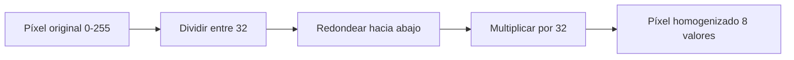

# Reducción de Niveles de Gris a 8

## 🎯 Objetivo

Reducir la cantidad de intensidades que maneja una imagen: pasar de **256 niveles de gris** (valores del 0 al 255) a solo **8 niveles**, homogenizando los píxeles que antes se diferenciaban por valores muy cercanos.

## 🧠 Idea clave

- Cada píxel de la imagen original puede tomar **256 valores** (del 0 al 255).
- Queremos agruparlos en **8 niveles**, por lo que cada nivel cubre un rango de:

$$ q = \frac{256}{8} = 32 $$

## 🧮 La fórmula

Para cada píxel se aplica un proceso de 3 pasos:

1. **Dividir** el valor del píxel entre 32:

$$ \frac{pixel}{32} $$

2. **Aproximar hacia abajo** (piso) para encontrar su nivel:

$$ nivel = \left\lfloor \frac{pixel}{32} \right\rfloor $$

3. **Multiplicar** el nivel por 32 para darle al píxel la intensidad completa:

$$ nuevo\_valor = nivel \times 32 $$

Todo se resume en una sola expresión:

$$ nuevo\_valor = \left\lfloor \frac{pixel}{32} \right\rfloor \times 32 $$

### Tabla de niveles

| Nivel | Rango original | Valor asignado |
| :---: | :------------: | :------------: |
| 0     | 0 – 31         | 0              |
| 1     | 32 – 63        | 32             |
| 2     | 64 – 95        | 64             |
| 3     | 96 – 127       | 96             |
| 4     | 128 – 159      | 128            |
| 5     | 160 – 191      | 160            |
| 6     | 192 – 223      | 192            |
| 7     | 224 – 255      | 224            |

## 🔍 Ejemplo paso a paso

### Píxel con valor 43

1. $43 / 32 = 1.34$
2. $\lfloor 1.34 \rfloor = 1$ → pertenece al **nivel 1**
3. $1 \times 32 = 32$ → nuevo valor: **32**

### Píxeles con valores 200 y 220

- $200 / 32 = 6.25$ → $\lfloor 6.25 \rfloor = 6$ → $6 \times 32 = \mathbf{192}$
- $220 / 32 = 6.875$ → $\lfloor 6.875 \rfloor = 6$ → $6 \times 32 = \mathbf{192}$

> [!important] Homogenización
> Los píxeles **200** y **220** eran dos intensidades diferentes y, después del procesamiento, **ambos valen 192**. Eso es exactamente el objetivo: eliminar la heterogeneidad y agrupar intensidades cercanas.

## 📊 Diagrama del proceso

## ❓ ¿Por qué hay que multiplicar de nuevo?

Después de dividir, el resultado es un número entre 0 y 8 (por ejemplo, 1.34). No podemos asignarle al píxel una intensidad en ese rango: la imagen necesita intensidades en el rango completo (0 a 255). Por eso primero **encontramos el nivel** y luego **multiplicamos por 32** para darle al píxel la intensidad completa correspondiente a ese nivel.

## ✅ Resultado

- **Antes:** la matriz manejaba hasta 255 valores diferentes.
- **Después:** toda la matriz solo contiene **8 valores diferentes** (0, 32, 64, 96, 128, 160, 192, 224).
- Visualmente la imagen pierde suavidad en los tonos de gris (efecto de *posterización* o cuantización gruesa).

## 🔗 Relacionado

- [[Inicio]] — mapa de contenidos de la materia
- *Pendiente:* suavizado de imágenes, histogramas

## 🏷️ Etiquetas

#visión-artificial #procesamiento-de-imágenes #niveles-de-gris #cuantización
