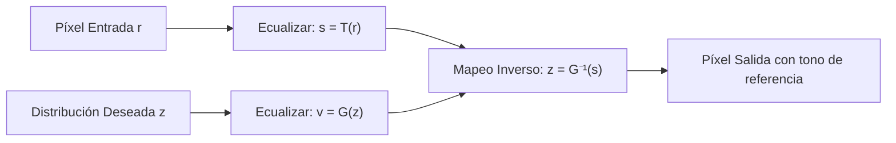

# Clase 6 — Ecualización y Especificación de Histogramas

> [!info] Fecha
> 📅 Martes, 8 de septiembre de 2026 — Semana 5

## 📝 Temas vistos

1. **Generación sintética de imágenes de bajo contraste**:
   - Compresión del rango dinámico aplicando una corrección gamma agresiva ($\gamma = 3.0$).
   - Concentración de los píxeles en el extremo oscuro (intensidades $\approx 0 - 40$).
2. **Ecualización Global de Histograma (`cv2.equalizeHist`)**:
   - Expansión automática del contraste en imágenes oscuras o subexpuestas.
   - Diagnóstico del histograma resultante: dispersión de las frecuencias a lo largo de todo el rango $[0, 255]$.
   - Fenómeno de "peine" (*comb effect*): por qué en datos discretos aparecen huecos/espaciados entre niveles en lugar de un histograma perfectamente continuo.
3. **Especificación o Emparejamiento de Histogramas (*Histogram Matching / Specification*)**:
   - Limitación de la ecualización clásica: genera siempre una distribución uniforme forzada, lo que en ocasiones produce ruido excesivo o aspecto poco natural.
   - Solución mediante especificación: transferir la distribución tonal y de contraste de una **imagen de referencia** hacia la imagen objetivo.
   - Implementación práctica con `skimage.exposure.match_histograms(input_img, reference_img)`.
   - Análisis comparativo de 3 etapas: Imagen de bajo contraste (Luna) $\to$ Imagen de referencia (Cameraman) $\to$ Imagen resultante (Luna adaptada a la iluminación del fotógrafo).

---

## 🧮 Fundamento Matemático y Algorítmico

### 📌 1. ¿Por qué la ecualización discreta tiene "picos separados"?
En teoría continua, la transformación acumulativa $s = T(r) = (L-1) \int_0^r p_r(w)dw$ genera una función de densidad estrictamente uniforme: $p_s(s) = \frac{1}{L-1}$.

Sin embargo, en imágenes digitales discretas ($r_k \in \{0, 1, \dots, 255\}$):
$$ s_k = \text{round}\left( (L - 1) \sum_{j=0}^k p_r(r_j) \right) $$
- Los niveles de entrada muy poblados se "estiran" a lo largo de la escala.
- Ningún píxel puede subdividirse en fracciones de intensidad, por lo que entre dos niveles mapeados quedan **huecos vacíos** con frecuencia 0.

---

### 📌 2. El Proceso de Emparejamiento (*Histogram Matching*) en 3 Pasos
Dada la imagen original con variable $r$ y la distribución deseada de referencia con variable $z$:

1. Se obtiene el valor ecualizado de la imagen origen: $s = T(r)$.
2. Se calcula la CDF de la imagen de referencia: $v = G(z)$.
3. Para cada nivel $s$, se busca el valor $z$ tal que $G(z) \approx s$. Este valor $z$ es la intensidad final asignada.

---

## 🖼️ Resultados Visuales de la Sesión

### 1. Ecualización de Histograma (Luna con Bajo Contraste $\gamma = 3.0$)
![[histograma-ecualizacion-luna-comparacion.png]]

> [!note] Análisis del resultado
> - **Fila 1 (Low Contrast):** Píxeles comprimidos en un pico agudo entre $0$ y $35$. La superficie lunar casi no se distingue del fondo.
> - **Fila 2 (Equalized):** Las intensidades se esparcen de $0$ a $255$. Los cráteres, sombras y crestas lunares emergen con alto contraste y relieve visible.

---

### 2. Especificación de Histograma (Luna adaptada al Cameraman)
![[histograma-matching-especificacion-comparacion.png]]

> [!note] Análisis del Matching
> - **Fila 1:** Imagen origen con bajo contraste (`img_low_contrast`).
> - **Fila 2:** Imagen de referencia (`ref_img = data.camera()`), con 3 modos claros en su histograma:
>   - Pico bajo ($0-30$): Abrigo negro del fotógrafo.
>   - Meseta media ($120-180$): Césped y suelo.
>   - Pico alto ($200-220$): Cielo brillante de fondo.
> - **Fila 3:** Imagen resultante (`match_img`). Conserva la forma de la luna, pero su histograma adoptó los 3 picos del fotógrafo.

---

## 🔗 Notas relacionadas

- 🧠 Conceptos:
  - [[Histogramas y Ecualización de Imagen]]
  - [[Transformaciones de Intensidad Espacial]]
  - [[Desbordamiento y Normalización de Imágenes]]
- 💻 Código:
  - [[Ecualización y Especificación de Histogramas - Python]]
  - [[Transformaciones de Intensidad y Histogramas - Python]]
- 📅 Sesiones previas:
  - [[2026-09-02 - Transformaciones de Intensidad y Procesamiento de Histogramas]]
  - [[2026-09-01 - Operaciones Aritméticas y Lógicas entre Imágenes]]

## 📌 Pendientes / tareas

- [ ] Probar `exposure.match_histograms` en imágenes a color (RGB) canal por canal vs en espacio LAB/HSV.
- [ ] Aplicar especificación de histogramas para normalizar fotografías tomadas con distintas exposiciones de cámara.

## 🏷️ Etiquetas

#visión-artificial #clase #histogramas #ecualización #histogram-matching #python #opencv #scikit-image
