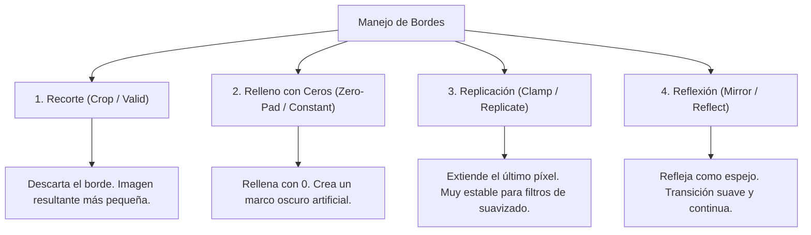

# Clase 7 — Filtrado Espacial, Convolución y Manejo de Bordes

> [!info] Fecha
> 📅 Miércoles, 9 de septiembre de 2026 — Semana 5

## 📝 Temas vistos

1. **Del procesamiento puntual a las operaciones de vecindad**:
   - Mientras las transformaciones de intensidad ($s = T(r)$) operaban píxel a píxel de forma aislada, el **filtrado espacial** calcula el nuevo valor de cada píxel considerando su entorno o **vecindad local**.
   - Terminología equivalente: **máscara**, **filtro**, **kernel** o **ventana**.
2. **Geometría del Kernel**:
   - **Dimensiones impares obligatorias** ($3 \times 3, 5 \times 5, 7 \times 7$): Garantizan la existencia de un **píxel ancla central único** en coordenadas $(0, 0)$.
   - Cada casilla de la máscara contiene un coeficiente o peso numérico que determina la relevancia de ese vecino en la respuesta resultante.
3. **Mecánica de Deslizamiento (*Sliding Window*)**:
   - El filtro se sobrepone en la esquina superior izquierda de la imagen, se calculan las multiplicaciones de los coeficientes por los píxeles subyacentes, se suman, y el resultado se escribe en el píxel central de una nueva matriz de salida.
   - Luego, la ventana se desplaza una columna hacia la derecha y se repite el proceso fila por fila.
4. **Correlación Espacial vs Convolución Espacial**:
   - **Correlación ($w \circ f$ o $f \otimes w$)**: Desliza el filtro tal como está sobre la imagen.
   - **Convolución ($w * f$)**: Rota el filtro **180 grados** (inversión horizontal y vertical) antes de multiplicar y sumar.
   - **Regla de oro:** $\text{Convolución} = \text{Correlación con el kernel invertido } 180^\circ$.
   - **¿Cuándo son iguales?**:
     - En **kernels simétricos** (e.g. filtros de media, gaussianos, laplaciano): la rotación de 180° no altera la matriz $\implies \text{Correlación} = \text{Convolución}$.
     - En **kernels asimétricos** (e.g. derivadas direccionales, detección de bordes horizontales/verticales): la rotación cambia el signo o la orientación $\implies \text{Correlación} \neq \text{Convolución}$.
5. **Manejo de Bordes y Efectos de Frontera (Padding)**:
   - Al colocar el kernel sobre los píxeles periféricos de la imagen, parte de la máscara sobresale de la matriz. Se analizaron los 4 métodos estándar para resolver esta frontera.

---

## 🧮 Comparativa Matemática: Correlación vs Convolución

Dada una imagen $f(x, y)$ y un kernel $w$ de tamaño $m \times n$ con semi-anchos $a = (m-1)/2$ y $b = (n-1)/2$:

### 1. Correlación Espacial
$$ g(x, y) = w \circ f(x, y) = \sum_{s=-a}^a \sum_{t=-b}^b w(s, t) f(x + s, y + t) $$

### 2. Convolución Espacial
$$ g(x, y) = w * f(x, y) = \sum_{s=-a}^a \sum_{t=-b}^b w(s, t) f(x - s, y - t) $$

> [!important] La Inversión de 180 Grados
> Rotar 180° significa reflejar primero horizontalmente y luego verticalmente:
> $$ \begin{bmatrix} 1 & 2 & 3 \\ 4 & 5 & 6 \\ 7 & 8 & 9 \end{bmatrix} \xrightarrow{180^\circ} \begin{bmatrix} 9 & 8 & 7 \\ 6 & 5 & 4 \\ 3 & 2 & 1 \end{bmatrix} $$
> Para una matriz impulso con un 1 en la esquina superior izquierda:
> $$ \begin{bmatrix} 1 & 0 & 0 \\ 0 & 0 & 0 \\ 0 & 0 & 0 \end{bmatrix} \xrightarrow{180^\circ} \begin{bmatrix} 0 & 0 & 0 \\ 0 & 0 & 0 \\ 0 & 0 & 1 \end{bmatrix} $$

---

## 📐 Los 4 Métodos de Manejo de Bordes (Padding) con Ejemplos

Supongamos una fila de píxeles original: $[10, 20, 30, 40, 50]$ y un kernel $3 \times 3$ que requiere extender **1 píxel** a cada extremo:

### 1. Recorte (*Crop / Valid*)
- **Concepto:** Se ignoran por completo los píxeles de frontera donde el filtro sobresalga. Solo se evalúan las posiciones donde el kernel cabe íntegramente dentro de la imagen.
- **Efecto dimensional:** Si la imagen mide $M \times N$ y el filtro $3 \times 3$, la imagen resultante medirá $(M - 2) \times (N - 2)$.
- **Ejemplo:** De $512 \times 512$ pasa a $510 \times 510$. No inventa datos pero reduce la resolución.

---

### 2. Relleno con Ceros (*Zero-Pad / Constant 0*)
- **Concepto:** Se agregan bordes artificiales con valor de intensidad $0$ (negro).
- **Ejemplo sobre la fila:**
  $$ [\mathbf{0} \mid 10, 20, 30, 40, 50 \mid \mathbf{0}] $$
- **Inconveniente:** Si los píxeles del borde son brillantes (ej. $200$), introducir un $0$ genera un salto brusco de contraste que el filtro interpretará como un falso borde (*ringing artifact* o borde oscuro).

---

### 3. Replicación / Abrazadera (*Clamp / Replicate*)
- **Concepto:** Se duplica el valor del píxel del extremo más próximo tantas veces como sea necesario.
- **Ejemplo sobre la fila:**
  $$ [\mathbf{10} \mid 10, 20, 30, 40, 50 \mid \mathbf{50}] $$
- **Ventaja:** Muy natural para filtros de suavizado y promedios; preserva los niveles de iluminación periféricos sin introducir artefactos oscuros.
- En OpenCV: `cv2.BORDER_REPLICATE`.

---

### 4. Reflexión / Espejo (*Mirror / Reflect*)
- **Concepto:** Se reflejan los valores interiores hacia afuera simétricamente, como un espejo puesto en la frontera.
- **Variante con borde duplicado (`BORDER_REFLECT`):**
  $$ [\mathbf{20}, \mathbf{10} \mid 10, 20, 30, 40, 50 \mid \mathbf{50}, \mathbf{40}] $$
- **Variante con borde no duplicado (`BORDER_REFLECT_101` / predeterminada en OpenCV):**
  $$ [\mathbf{20} \mid 10, 20, 30, 40, 50 \mid \mathbf{40}] $$
- **Ventaja:** Garantiza continuidad geométrica suave de primer orden, ideal para detección de bordes y cálculo de gradientes.

---

## 🔗 Notas relacionadas

- 🧠 Conceptos:
  - [[Filtrado Espacial y Convolución]]
  - [[Manejo de Bordes y Padding en Imágenes]]
  - [[Vecindad y Adyacencia de Píxeles]]
  - [[Histogramas y Ecualización de Imagen]]
- 💻 Código:
  - [[Filtrado Espacial y Modos de Padding - Python]]
- 📅 Sesiones previas:
  - [[2026-09-08 - Ecualización y Especificación de Histogramas]]
  - [[2026-09-02 - Transformaciones de Intensidad y Procesamiento de Histogramas]]

## 📌 Pendientes / tareas

- [ ] Comparar tiempos de ejecución y respuestas en bordes de `cv2.filter2D` con diferentes flags de `borderType`.
- [ ] Implementar un filtro de media $3 \times 3$ manual con NumPy para visualizar el desplazamiento paso a paso.

## 🏷️ Etiquetas

#visión-artificial #clase #filtrado-espacial #convolución #correlación #padding #bordes
