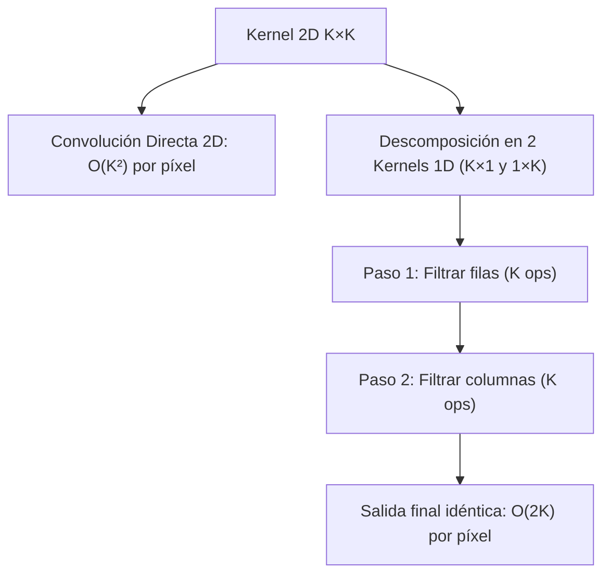

# Clase 9 — Filtros de Suavizado y Separabilidad de Kernels

> [!info] Fecha
> 📅 Miércoles, 23 de septiembre de 2026 — Semana 7

## 📝 Temas vistos

1. **Repaso de máscaras espaciales y geometría del kernel**:
   - Máscaras simétricas cuadradas de dimensión impar ($3 \times 3, 5 \times 5, \dots$).
   - Garantía del píxel ancla central único $(0, 0)$.
   - Convolución como rotación de 180° y gestión de efectos de frontera (padding).
2. **Optimización Computacional: Separabilidad de Kernels**:
   - Descomposición de un kernel 2D de tamaño $K \times K$ en el producto exterior de dos vectores unidimensionales 1D ($K \times 1$ y $1 \times K$):
     $$ K_{2D} = v \cdot h^T $$
   - **Reducción de complejidad algorítmica**:
     - Convolución 2D directa: $\mathcal{O}(K^2)$ multiplicaciones/sumas por píxel.
     - Convolución separable 1D + 1D: $\mathcal{O}(2K)$ operaciones por píxel (filtrar por filas y luego por columnas).
     - **Ejemplos prácticos de ahorro de cómputo:**
       - Kernel $3 \times 3$: $9$ ops $\to 3 + 3 = \mathbf{6}$ ops.
       - Kernel $5 \times 5$: $25$ ops $\to 5 + 5 = \mathbf{10}$ ops.
       - Kernel $21 \times 21$: $441$ ops $\to 21 + 21 = \mathbf{42}$ ops (¡más del 90% de reducción!).
3. **Filtro de Caja / Promedio (*Box Filter / Mean Filter*)**:
   - Promedio aritmético no ponderado de la vecindad: todos los coeficientes valen $\frac{1}{K^2}$.
   - Es separable de forma trivial: $\frac{1}{K} [1, \dots, 1]^T \times \frac{1}{K} [1, \dots, 1]$.
   - Desventaja: produce un desenfoque tosco y artefactos rectangulares en bordes.
4. **Filtro Gaussiano (*Gaussian Filter*)**:
   - Ponderación no uniforme basada en la campana de Gauss:
     $$ G(x, y) = \frac{1}{2\pi \sigma^2} e^{-\frac{x^2 + y^2}{2\sigma^2}} $$
   - El parámetro $\sigma$ (desviación estándar) controla el radio de influencia y qué tan puntiaguda o extendida es la campana.
   - **Propiedad de separabilidad perfecta:** $G(x, y) = G(x) \cdot G(y)$.
   - A diferencia del filtro de caja, no genera artefactos direccionales y preserva mejor la naturalidad de la imagen.
5. **Filtro de la Mediana (*Median Filter*)**:
   - **Filtro espacial no lineal**: no realiza convolución ni multiplicaciones.
   - Ordena los píxeles de la vecindad de menor a mayor y selecciona el valor central (mediana).
   - **Especialidad:** Eliminación impecable del **ruido impulsivo o de sal y pimienta** (*salt-and-pepper*).
   - **¿Por qué falla el Gaussiano con sal y pimienta?** Porque al calcular un promedio ponderado, un píxel de ruido extremo (0 o 255) contamina y mancha a todos sus vecinos. La mediana descarta los valores atípicos mandándolos a los extremos de la lista ordenada.
   - Casos reales: eliminación de pájaros que cruzan fotos del cielo, motas de polvo en sensores o píxeles muertos de cámara.

---

## 🧮 Comparativa de Complejidad: Convolución Estándar vs Separable

| Tamaño Kernel | Operaciones 2D ($K^2$) | Operaciones Separables ($2K$) | Factor de Aceleración |
| :-----------: | :--------------------: | :---------------------------: | :-------------------: |
| $3 \times 3$  | 9                      | 6                             | $1.5\times$           |
| $5 \times 5$  | 25                     | 10                            | $2.5\times$           |
| $11 \times 11$| 121                    | 22                            | $5.5\times$           |
| $21 \times 21$| 441                    | 42                            | **$10.5\times$**      |

---

## ⚖️ Los 3 Filtros de Suavizado Frente a Frente

| Característica | Filtro de Caja (Promedio) | Filtro Gaussiano | Filtro de la Mediana |
| :--- | :--- | :--- | :--- |
| **Naturaleza** | Lineal | Lineal | **No lineal** |
| **Pesos** | Iguales ($\frac{1}{K^2}$) | Gaussianos (centro mayor peso) | No usa pesos (ordenamiento) |
| **Separable** | ✅ Sí | ✅ Sí | ❌ No |
| **Tipo de ruido ideal** | Ruido uniforme leve | Ruido gaussiano / aditivo | **Ruido Sal y Pimienta (Impulsivo)** |
| **Efecto en bordes** | Desenfoque tosco y artefactos cuadrados | Desenfoque suave y continuo | **Preserva bordes nítidos** sin difuminar |

---

## 🔗 Notas relacionadas

- 🧠 Conceptos:
  - [[Filtros de Suavizado Espacial]]
  - [[Filtrado Espacial y Convolución]]
  - [[Manejo de Bordes y Padding en Imágenes]]
- 💻 Código:
  - [[Filtros de Suavizado y Separabilidad - Python]]
  - [[Filtrado Espacial y Modos de Padding - Python]]
- 📅 Sesión previa:
  - [[2026-09-15 - Implementación de Convolución y Modos de Borde]]

## 📌 Pendientes / tareas

- [ ] Medir el tiempo de ejecución en Python con `time.perf_counter` entre `cv2.filter2D` y `cv2.sepFilter2D`.
- [ ] Probar la eliminación de ruido sal y pimienta con `cv2.medianBlur` vs `cv2.GaussianBlur` sobre una imagen propia.

## 🏷️ Etiquetas

#visión-artificial #clase #filtrado-espacial #suavizado #filtro-gaussiano #filtro-mediana #separabilidad #opencv #python
