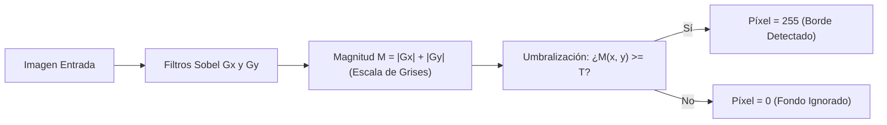

# Clase 12 — Operadores de Gradiente: Roberts, Prewitt y Sobel

> [!info] Fecha
> 📅 Miércoles, 7 de octubre de 2026 — Semana 9

## 📝 Temas vistos

1. **El vector Gradiente 2D ($\nabla f$)**:
   - Representa la primera derivada espacial en dos dimensiones:
     $$ \nabla f = \begin{bmatrix} G_x \\ G_y \end{bmatrix} = \begin{bmatrix} \frac{\partial f}{\partial x} \\ \frac{\partial f}{\partial y} \end{bmatrix} $$
   - **$G_x$:** Mide cambios de luz horizontales (detecta **bordes verticales**).
   - **$G_y$:** Mide cambios de luz verticales (detecta **bordes horizontales**).
   - **Magnitud del gradiente ($M$):** Intensidad o fuerza del borde:
     $$ M(x, y) = \sqrt{G_x^2 + G_y^2} \approx |G_x| + |G_y| $$
   - **Dirección ($\theta$):** Ángulo ortogonal a la tangente del contorno:
     $$ \theta(x, y) = \arctan\left(\frac{G_y}{G_x}\right) $$
2. **Evolución Histórica de los Operadores de Gradiente**:
   - **Operador de Roberts (1963):** Máscaras diagonales $2 \times 2$. Rápido pero sin centro entero y ultra vulnerable al ruido.
   - **Operador de Prewitt (1970):** Máscaras $3 \times 3$. Introduce **suavizado lineal promedio** en el eje perpendicular a la derivada.
   - **Operador de Sobel (1968):** Máscaras $3 \times 3$. Sustituye el promedio lineal por una **ponderación triangular / aproximación Gaussiana $[1, 2, 1]$**, dando mayor peso a los vecinos directos.
3. **Umbralización del Gradiente (*Thresholding*)**:
   - La magnitud del gradiente produce una imagen continua en escala de grises.
   - El ingeniero define un umbral de corte $T$ para obtener un mapa binario de bordes (blanco sobre fondo negro).
4. **Sobel como Motor de Algoritmos Modernos**:
   - Sobel es la pieza angular de métodos avanzados como el **Detector de Bordes Canny**, los descriptores **HOG** (detección de peatones) y puntos de interés **SIFT/SURF**.

---

## 💡 Explicación Didáctica: ¿Por qué los Kernels tienen esa forma?

> [!tip] El "Secreto" de Prewitt y Sobel: Separabilidad
> Ambos operadores no son una fórmula misteriosa: son el resultado de multiplicar **una Derivada en un eje** por un **Filtro de Suavizado en el otro eje**.

```text
       [Derivada en X]   x   [Suavizado en Y]   =   Kernel 2D Gx
      [-1    0    +1]    x       [ 1 ]          =   [-1   0   +1]
                                 [ 1 ]              [-1   0   +1]
                                 [ 1 ]              [-1   0   +1]
```

### 1. ¿Por qué $G_x$ tiene $-1$ a la izquierda, $0$ al centro y $+1$ a la derecha?
- Para detectar una línea vertical (ej. una pared blanca contra un fondo negro), la luz cambia al moverte en la dirección horizontal ($X$).
- La máscara calcula: **(Píxeles de la derecha) $-$ (Píxeles de la izquierda)**.
- El centro es $0$ porque es la coordenada ancla de referencia (diferencia central simétrica).
- Las tres filas con $[-1, 0, +1]$ promedian la señal verticalmente para que un píxel ruidoso aislado no falsee el cálculo.

### 2. ¿Por qué $G_y$ tiene $-1$ arriba, $0$ al centro y $+1$ abajo?
- Para detectar una línea horizontal (ej. el horizonte o el suelo), la luz cambia al moverte verticalmente ($Y$).
- La máscara calcula: **(Píxeles de abajo) $-$ (Píxeles de arriba)**.
- El centro es una fila de ceros $[0, 0, 0]$ para actuar como pivote.

---

## 🔬 Sobel: ¿Por qué tiene un $2$ en el centro?

$$ G_x = \begin{bmatrix} -1 & 0 & +1 \\ \mathbf{-2} & \mathbf{0} & \mathbf{+2} \\ -1 & 0 & +1 \end{bmatrix} = \begin{bmatrix} 1 \\ \mathbf{2} \\ 1 \end{bmatrix} \times \begin{bmatrix} -1 & 0 & +1 \end{bmatrix} $$

- En una cuadrícula cartesiana:
  - Los vecinos directos (arriba, abajo, izquierda, derecha) están a una distancia de **$1.0$ píxel**.
  - Los vecinos diagonales están a una distancia de **$\sqrt{2} \approx 1.414$ píxeles** (más lejos).
- Sobel le da un peso de **$2$ al vecino más cercano** y un peso de **$1$ a los diagonales más lejanos**.
- Esto actúa como un **filtro Gaussiano en miniatura $[1, 2, 1]^T$**, logrando que Sobel suprima el ruido muchísimo mejor que Prewitt manteniendo una velocidad de cálculo instantánea.

---

## 📊 El Veredicto de la Primera Derivada

| Criterio | Roberts | Prewitt | Sobel |
| :--- | :---: | :---: | :---: |
| **Tamaño de máscara** | $2 \times 2$ (Diagonal) | $3 \times 3$ (Simétrica) | $3 \times 3$ (Simétrica) |
| **Punto ancla central** | ❌ No (descentrado) | ✅ Sí $(0, 0)$ | ✅ Sí $(0, 0)$ |
| **Suavizado integrado** | Ninguno | Lineal $[1, 1, 1]$ | **Gaussiano $[1, 2, 1]$** |
| **Sensibilidad al ruido** | 🔴 **Extrema** (genera ruido falso) | 🟡 **Media** | 🟢 **Baja** (la más limpia) |
| **Precisión direccional** | Pobre (ejes a $45^\circ$) | Buena (ortogonal) | **Excelente / Óptima** |
| **Uso en la industria** | Casi obsoleto | Académico / Didáctico | **Estándar industrial (OpenCV)** |

---

## 🎚️ Umbralización del Gradiente (*Thresholding*)

La magnitud $M(x, y)$ entrega valores entre $0$ y cientos de unidades de gradiente:



- **Si $T$ es muy bajo:** Detecta todos los bordes, pero el mapa se llena de "manchas" por ruido.
- **Si $T$ es muy alto:** Solo quedan los bordes más violentos, perdiendo siluetas continuas.

---

## 🔗 Notas relacionadas

- 🧠 Conceptos:
  - [[Operadores de Gradiente - Roberts, Prewitt y Sobel]]
  - [[Derivadas Espaciales en Imágenes]]
  - [[Filtros de Suavizado Espacial]]
  - [[Filtrado Espacial y Convolución]]
- 💻 Código:
  - [[Operadores de Gradiente - Roberts, Prewitt y Sobel - Python]]
  - [[Derivadas y Bordes - Python]]
- 📅 Sesión previa:
  - [[2026-09-30 - Realce de Imágenes - Unsharp Masking y High-Boost Filtering]]

## 📌 Pendientes / tareas

- [ ] Comparar visualmente la respuesta de Roberts, Prewitt y Sobel sobre una imagen con ruido Gaussiano controlado.
- [ ] Implementar el detector Canny en OpenCV y observar cómo utiliza los gradientes de Sobel internamente.

## 🏷️ Etiquetas

#visión-artificial #clase #detección-de-bordes #gradiente #roberts #prewitt #sobel #opencv #python
