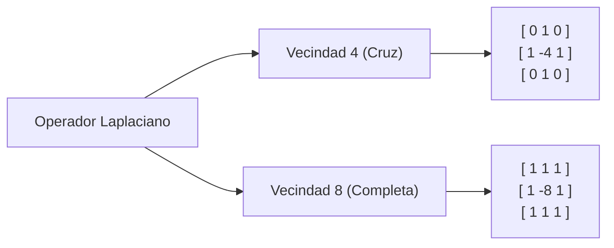

# Derivadas Espaciales en Imágenes

## 🎯 Definición

En visión artificial, las **derivadas espaciales** son operadores diferenciales discretos que calculan la tasa de cambio local de la intensidad entre píxeles vecinos. Constituyen la base fundamental de los algoritmos de **detección de bordes, contornos y características geométricas**.

---

## 🧮 1. Primera Derivada: Diferencias Finitas y Gradiente

Dado que la separación mínima entre píxeles es $\Delta x = 1$, la primera derivada se aproxima mediante diferencias finitas:

### Aproximaciones 1D:
1. **Diferencia hacia adelante (*Forward difference*):**
   $$ \frac{\partial f}{\partial x} \approx f(x + 1) - f(x) $$
2. **Diferencia hacia atrás (*Backward difference*):**
   $$ \frac{\partial f}{\partial x} \approx f(x) - f(x - 1) $$
3. **Diferencia central (*Central difference* — simétrica y más precisa):**
   $$ \frac{\partial f}{\partial x} \approx \frac{f(x + 1) - f(x - 1)}{2} $$

### El Vector Gradiente 2D ($\nabla f$):
En dos dimensiones, la primera derivada se representa mediante un **vector** que apunta en la dirección de máximo cambio de intensidad:

$$ \nabla f = \begin{bmatrix} G_x \\ G_y \end{bmatrix} = \begin{bmatrix} \frac{\partial f}{\partial x} \\ \frac{\partial f}{\partial y} \end{bmatrix} $$

- **Magnitud del gradiente (fuerza del borde):**
  $$ M(x, y) = \|\nabla f\| = \sqrt{G_x^2 + G_y^2} \approx |G_x| + |G_y| $$
- **Dirección del gradiente (orientación perpendicular al borde):**
  $$ \alpha(x, y) = \arctan\left( \frac{G_y}{G_x} \right) $$

---

## 🧮 2. Segunda Derivada: El Operador Laplaciano

La segunda derivada mide la curvatura o tasa de cambio de la pendiente. Aplicando la diferencia hacia adelante a la diferencia hacia atrás:

$$ \frac{\partial^2 f}{\partial x^2} \approx [f(x + 1) - f(x)] - [f(x) - f(x - 1)] = f(x + 1) + f(x - 1) - 2f(x) $$

### El Operador Laplaciano 2D ($\nabla^2 f$):
Es el operador diferencial de segundo orden lineal e **isotrópico** (invariante ante rotaciones) más importante en visión:

$$ \nabla^2 f = \frac{\partial^2 f}{\partial x^2} + \frac{\partial^2 f}{\partial y^2} = f(x+1, y) + f(x-1, y) + f(x, y+1) + f(x, y-1) - 4f(x, y) $$

### Máscaras convolucionales $3 \times 3$:



---

## 🔬 Comparativa de Comportamiento ante Bordes

```text
Perfil de Intensidad:   [Oscuro] --------/-------- [Claro]
                                     Rampa

1ra Derivada (Gradiente):  0     ---/¨¨¨¨¨¨\---      0
                                  (Borde Grueso)

2da Derivada (Laplaciano): 0     ---+       -0-      0
                                    |       |
                                    \---+---/
                              (Cruce por Cero / Zero-crossing)
```

1. **En zonas planas:** Ambas derivadas son idénticas a $0$.
2. **En rampas (transiciones suaves):**
   - La **1ra derivada** permanece positiva y constante a lo largo de toda la subida $\to$ produce un **borde ancho o grueso**.
   - La **2da derivada** es $0$ durante la pendiente constante, y solo genera picos opuestos en el punto donde inicia y termina la rampa.
3. **El Cruce por Cero (*Zero-Crossing*):**
   - En la 2da derivada, el borde real se localiza exactamente en el punto donde la señal pasa de positiva a negativa atravesando el cero.

---

## ⚠️ El Problema Crítico del Ruido y la Solución LoG

> [!danger] Extrema Sensibilidad al Ruido
> Las derivadas son operadores de alta frecuencia. Si un píxel tiene una pequeña perturbación de ruido $+5$, la 1ra derivada amplifica esa variación, y la 2da derivada la multiplica agresivamente por $-4$ o $-8$, destruyendo la señal.

### Solución: Laplaciano del Gaussiano (LoG / Filtro Mexican Hat)
Para poder usar la 2da derivada sin ser destruido por el ruido, se suaviza primero la imagen con un filtro Gaussiano y luego se aplica el Laplaciano:

$$ \text{LoG}(x, y) = \nabla^2 [G_\sigma(x, y) * f(x, y)] = [\nabla^2 G_\sigma(x, y)] * f(x, y) $$

---

## 🔗 Relacionado

- [[Filtrado Espacial y Convolución]] — aplicación mediante máscaras convolucionales
- [[Filtros de Suavizado Espacial]] — filtro Gaussiano como preprocesamiento imprescindible
- [[2026-09-29 - Derivadas Espaciales y Detección de Bordes]] — clase teórica
- [[Derivadas y Bordes - Python]] — código en OpenCV y NumPy
- [[Inicio]] — mapa general de la materia

---

## 🏷️ Etiquetas

#visión-artificial #procesamiento-de-imágenes #derivadas-espaciales #detección-de-bordes #gradiente #laplaciano #sobel #log
