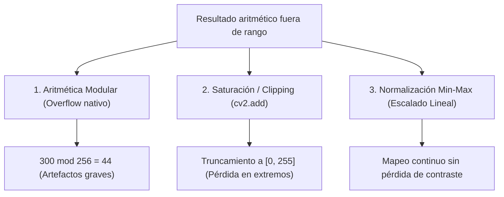

# Desbordamiento y Normalización de Imágenes

## 🎯 Definición

Las imágenes digitales convencionales se codifican comúnmente en formato de **enteros de 8 bits sin signo (`uint8`)**, lo que restringe los valores de intensidad al intervalo discreto:

$$ [0, 255] $$

Al realizar operaciones aritméticas (sumas, restas, multiplicaciones), los resultados frecuentemente caen **fuera de este rango**. Existen tres estrategias para gestionar estas discrepancias:

---

## 🔬 Las 3 Estrategias de Manejo

### 1. Desbordamiento Modular (*Wrap-around / Overflow*)
- Comportamiento por defecto en bibliotecas como NumPy al operar directamente con matrices `uint8` (`img1 + img2`).
- Al sobrepasar 255, el valor se calcula mediante módulo 256:
  $$ \text{valor} = (f_1 + f_2) \pmod{256} $$
- **Ejemplo:** $200 + 100 = 300 \to 300 - 256 = \mathbf{44}$.
- **Consecuencia:** Píxeles que deberían ser muy brillantes se vuelven abruptamente negros/oscuros, arruinando la imagen visualmente.

---

### 2. Saturación / Recorte (*Clipping*)
- Comportamiento implementado en OpenCV (`cv2.add`, `cv2.subtract`).
- Trunca los valores excedentes fijándolos en los límites absolutos:
  $$ g(x, y) = \min(\max(f(x, y), 0), 255) $$
- **Ejemplo:** $200 + 100 = 300 \to \min(300, 255) = \mathbf{255}$.
- **Consecuencia:** Previene artefactos modulares, pero produce áreas de "quemado" (blanco plano) donde se pierde todo el detalle de texturas altas.

---

### 3. Normalización Min-Max (*Linear Rescaling*)
- Convierte la matriz a coma flotante (`float`), preserva las relaciones relativas entre todos los píxeles y reescala linealmente todo el rango al intervalo $[0, 255]$:

$$ f_s = 255 \times \left[ \frac{f - \min(f)}{\max(f) - \min(f)} \right] $$

---

## 🧮 Demostración Numérica Paso a Paso

Supongamos una operación que produjo el siguiente vector de intensidades con valores negativos y superiores a 255:

$$ F = [-50, 0, 100, 300, 460] $$

- **Paso 1: Identificar extremos**
  - $\min(F) = -50$
  - $\max(F) = 460$
- **Paso 2: Calcular el rango dinámico total**
  $$ \text{rango} = \max(F) - \min(F) = 460 - (-50) = 510 $$
- **Paso 3: Aplicar la transformación a cada elemento**

| Valor original $f$ | Numerador $(f - \min)$ | Fracción $(\frac{f - \min}{\text{rango}})$ | Multiplicación por 255 | Valor final escalado $f_s$ |
| :----------------: | :--------------------: | :----------------------------------------: | :--------------------: | :------------------------: |
| $-50$ | $-50 - (-50) = 0$ | $0 / 510 = 0.000$ | $255 \times 0.000$ | **0** (Negro) |
| $0$ | $0 - (-50) = 50$ | $50 / 510 \approx 0.098$ | $255 \times 0.098$ | **25** |
| $100$ | $100 - (-50) = 150$ | $150 / 510 \approx 0.294$ | $255 \times 0.294$ | **75** |
| $300$ | $300 - (-50) = 350$ | $350 / 510 \approx 0.686$ | $255 \times 0.686$ | **175** |
| $460$ | $460 - (-50) = 510$ | $510 / 510 = 1.000$ | $255 \times 1.000$ | **255** (Blanco) |

> [!tip] Ventaja clave
> Ningún píxel queda negativo, no ocurre desbordamiento modular y se preserva el contraste relativo completo de la escena.

---

## ⚖️ Alternativa: Mezcla Ponderada (*Alpha Blending*)

Para promediar dos imágenes sin exceder nunca el rango de 255:

$$ g(x, y) = \alpha f_1(x, y) + \beta f_2(x, y) + \gamma \quad \text{con } \alpha + \beta = 1.0 $$

- En OpenCV: `cv2.addWeighted(img1, 0.5, img2, 0.5, 0)`.

---

## 🔗 Relacionado

- [[Operaciones Aritméticas entre Imágenes]] — suma, resta, multiplicación y división
- [[Tamaño de una Imagen Digital]] — representación en bits y niveles de gris
- [[2026-09-01 - Operaciones Aritméticas y Lógicas entre Imágenes]] — clase teórica
- [[Operaciones Aritméticas y Normalización - Python]] — comparación visual de los métodos
- [[Inicio]] — mapa general de la materia

---

## 🏷️ Etiquetas

#visión-artificial #procesamiento-de-imágenes #desbordamiento #normalización #clipping
