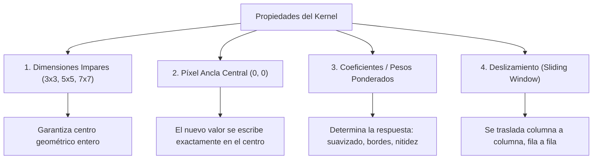

# Filtrado Espacial y Convolución

## 🎯 Definición

El **filtrado en el dominio espacial** consiste en pasar una submatriz de coeficientes numéricos denominada **máscara**, **filtro**, **kernel** o **ventana** sobre cada píxel de una imagen digital, reemplazando el valor original por una combinación lineal calculada a partir de los píxeles de su **vecindad local**.

---

## 🔬 Geometría y Propiedades del Kernel

> [!important] ¿Por qué dimensiones impares ($2k+1 \times 2k+1$)?
> Si usáramos un kernel par (e.g. $2 \times 2$ o $4 \times 4$), el centro geométrico caería en la división entre cuatro píxeles, imposibilitando escribir el resultado sobre una coordenada entera $(x, y)$ sin desplazar físicamente la imagen medio píxel.

---

## 🧮 Correlación vs Convolución en 2D

Dada una imagen $f(x, y)$ de tamaño $M \times N$ y un kernel $w(s, t)$ de tamaño $m \times n$ con semi-anchos $a = \frac{m-1}{2}$ y $b = \frac{n-1}{2}$:

### 1. Correlación Cruzada Espacial ($w \circ f$)
El filtro se desplaza directamente sobre la imagen sin rotación:
$$ g(x, y) = \sum_{s=-a}^a \sum_{t=-b}^b w(s, t) f(x + s, y + t) $$

### 2. Convolución Discreta 2D ($w * f$)
El filtro se **rota 180 grados** (invertido horizontal y verticalmente) antes de aplicar la suma de productos:
$$ g(x, y) = \sum_{s=-a}^a \sum_{t=-b}^b w(s, t) f(x - s, y - t) $$

---

## 🔄 La Regla de Oro y la Rotación de 180°

$$ w * f = w_{180^\circ} \circ f $$

Rotar una matriz $180^\circ$ equivale a trasponer sus filas y columnas de manera invertida:

$$ \begin{bmatrix} w_{11} & w_{12} & w_{13} \\ w_{21} & w_{22} & w_{23} \\ w_{31} & w_{32} & w_{33} \end{bmatrix} \xrightarrow{180^\circ} \begin{bmatrix} w_{33} & w_{32} & w_{31} \\ w_{23} & w_{22} & w_{21} \\ w_{13} & w_{12} & w_{11} \end{bmatrix} $$

### ¿Cuándo importa la diferencia?
- **Kernels Simétricos ($w = w_{180^\circ}$):**
  - Ejemplos: Filtro de caja (media), filtro Gaussiano, Laplaciano.
  - Como la rotación de 180° deja la matriz idéntica, **la correlación y la convolución producen exactamente el mismo resultado**.
- **Kernels Asimétricos ($w \neq w_{180^\circ}$):**
  - Ejemplos: Operadores de gradiente y derivadas direccionales (Sobel horizontal $G_x$, Prewitt).
  - La convolución invierte los signos de la derivada; si no se rota el kernel, los bordes detectados tendrán el signo opuesto al gradiente real.

---

## ⚖️ Filtros Lineales vs No Lineales

1. **Filtros Lineales:** La salida es una suma ponderada lineal de los vecinos (implementables mediante convolución). Ejemplo: Filtro de la media, desenfoque gaussiano.
2. **Filtros No Lineales:** La operación no es una combinación lineal directa, sino una función de ordenamiento o lógica sobre la vecindad. Ejemplo: **Filtro de la mediana** (ordena los vecinos y toma el valor central para eliminar ruido de sal y pimienta sin desenfocar bordes).

---

## 🔗 Relacionado

- [[Manejo de Bordes y Padding en Imágenes]] — cómo tratar los extremos donde el kernel se desborda
- [[Vecindad y Adyacencia de Píxeles]] — fundamentos de vecindad $N_4$ y $N_8$
- [[2026-09-09 - Filtrado Espacial, Convolución y Manejo de Bordes]] — clase correspondiente
- [[Filtrado Espacial y Modos de Padding - Python]] — código en OpenCV y SciPy
- [[Inicio]] — mapa de contenidos

---

## 🏷️ Etiquetas

#visión-artificial #procesamiento-de-imágenes #filtrado-espacial #convolución #correlación #kernels
