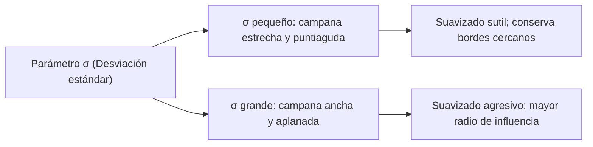

# Filtros de Suavizado Espacial

## 🎯 Definición y Propósito

Los **filtros de suavizado** (también conocidos como *filtros paso bajo*) se utilizan en el dominio espacial principalmente para dos propósitos fundamentales:
1. **Reducción de ruido:** Atenuar fluctuaciones espaciales aleatorias provocadas por sensores de baja calidad o iluminación precaria.
2. **Preprocesamiento:** Suavizar detalles irrelevantes o texturas finas antes de realizar tareas de mayor nivel como segmentación, binarización o detección de contornos.

---

## 🔬 1. Filtro de Caja / Promedio (*Box Filter*)

Reemplaza cada píxel por el promedio aritmético simple de los píxeles de su vecindad $K \times K$:

$$ w = \frac{1}{K^2} \begin{bmatrix} 1 & 1 & \dots & 1 \\ 1 & 1 & \dots & 1 \\ \vdots & \vdots & \ddots & \vdots \\ 1 & 1 & \dots & 1 \end{bmatrix} $$

- **Características:**
  - Todos los vecinos tienen exactamente el mismo peso de influencia.
  - Genera un desenfoque tosco y bordes con artefactos en forma de caja o cuadrícula (*blocking artifacts*).
  - En OpenCV: `cv2.blur(img, (k, k))` o `cv2.boxFilter()`.

---

## 🔬 2. Filtro Gaussiano (*Gaussian Filter*)

A diferencia del filtro de caja, asigna un peso que decae exponencialmente con la distancia radial al centro, siguiendo una distribución normal bivariada:

$$ G(x, y) = \frac{1}{2\pi \sigma^2} e^{-\frac{x^2 + y^2}{2\sigma^2}} $$

- **Ventajas frente al filtro de caja:**
  - **Isotropía rotacional:** Suaviza por igual en todas las direcciones espaciales, sin privilegiar filas ni columnas.
  - Elimina las altas frecuencias de forma suave, sin generar rebotes ni patrones rectangulares artificiales.
  - En OpenCV: `cv2.GaussianBlur(img, (k, k), sigmaX)`.

---

## ⚡ Separabilidad de Kernels: Optimización de $\mathcal{O}(K^2)$ a $\mathcal{O}(2K)$

Un kernel 2D $K$ es **separable** si se puede expresar como el producto exterior de dos vectores unidimensionales:

$$ K = v \cdot h^T \quad \text{donde } v \in \mathbb{R}^{K \times 1}, \; h \in \mathbb{R}^{K \times 1} $$

### Separabilidad de la Gaussiana:
La exponencial de una suma es el producto de exponenciales:

$$ G(x, y) = \left( \frac{1}{\sqrt{2\pi}\sigma} e^{-\frac{x^2}{2\sigma^2}} \right) \cdot \left( \frac{1}{\sqrt{2\pi}\sigma} e^{-\frac{y^2}{2\sigma^2}} \right) = G(x) \cdot G(y) $$

### Impacto en la complejidad de cálculo:
- **Convolución 2D tradicional:** Para cada píxel de la imagen se realizan $K \times K = K^2$ multiplicaciones y sumas.
- **Convolución separable:** Primero se convoluciona toda la imagen con el vector horizontal 1D ($K$ ops) y el resultado se convoluciona con el vector vertical 1D ($K$ ops). Total: **$2K$ operaciones por píxel**.

$$ \text{Ahorro para } K=21: \quad \frac{K^2}{2K} = \frac{441}{42} \approx \mathbf{10.5\times \text{ más rápido}} $$

- En OpenCV: `cv2.sepFilter2D(img, ddepth, kernelX, kernelY)`.

---

## 🛡️ 3. Filtro de la Mediana (*Median Filter*)

Es un **filtro espacial no lineal** perteneciente a los *filtros de orden estadístico*:
1. Toma todos los píxeles dentro de la ventana de vecindad $K \times K$.
2. Los ordena ascendentemente de menor a mayor intensidad.
3. Asigna al píxel central el valor ubicado exactamente en la mitad de la lista ordenada (la **mediana**).

### El problema del Ruido de Sal y Pimienta (*Salt & Pepper*):
- Los píxeles de ruido impulsivo adoptan valores extremos ($0$ = negro/pimienta, $255$ = blanco/sal).
- **Por qué falla el filtro Gaussiano/Caja:** Al promediar, el valor $255$ o $0$ entra a la suma y contamina a todos los píxeles sanos del vecindario, transformando el punto brillante en una mancha borrosa grisácea.
- **Por qué triunfa la Mediana:** Al ordenar la lista, los valores extremos $0$ y $255$ quedan relegados a los extremos (al inicio o al final). La posición central (la mediana) siempre seleccionará un píxel real del fondo sano, **eliminando el ruido al 100% y preservando la nitidez de los bordes**.

---

## 📊 Matriz Comparativa

| Filtro | Tipo | Separable | Complejidad | Mejor para | Preservación de Bordes |
| :--- | :--- | :---: | :---: | :--- | :--- |
| **Caja / Promedio** | Lineal | ✅ Sí | $\mathcal{O}(2K)$ | Suavizado rápido general | ❌ Pobre (desenfoque rectangular) |
| **Gaussiano** | Lineal | ✅ Sí | $\mathcal{O}(2K)$ | Ruido gaussiano / aditivo | ⚠️ Media (suave continuo) |
| **Mediana** | **No lineal** | ❌ No | $\mathcal{O}(K^2 \log K)$ | **Ruido Sal y Pimienta** | ✅ **Excelente (no difumina bordes)** |

---

## 🔗 Relacionado

- [[Filtrado Espacial y Convolución]] — fundamentos de máscaras y deslizamiento
- [[Manejo de Bordes y Padding en Imágenes]] — tratamiento de fronteras
- [[2026-09-23 - Filtros de Suavizado y Separabilidad de Kernels]] — clase teórica
- [[Filtros de Suavizado y Separabilidad - Python]] — implementación práctica
- [[Inicio]] — mapa general de la materia

---

## 🏷️ Etiquetas

#visión-artificial #procesamiento-de-imágenes #suavizado #filtro-gaussiano #filtro-caja #filtro-mediana #separabilidad #kernels
