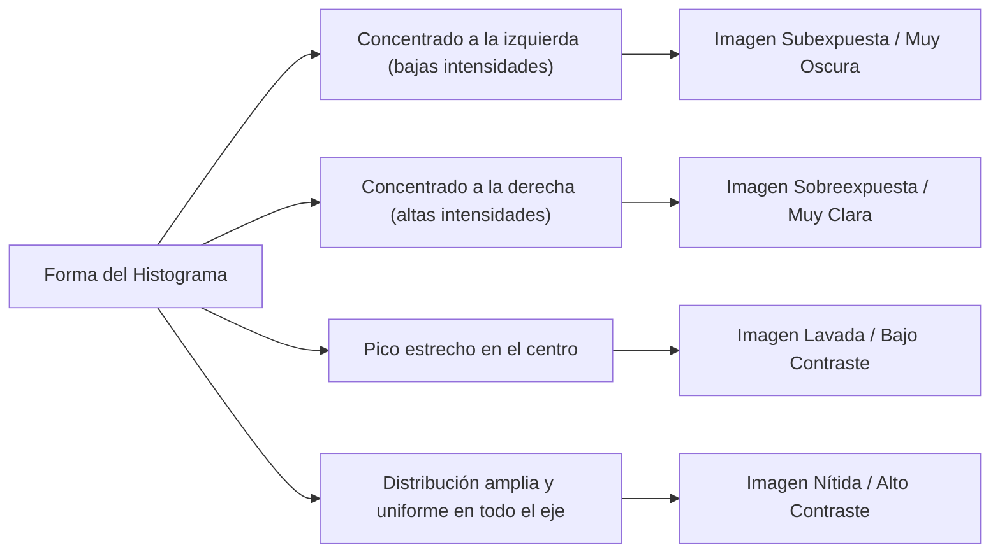

# Histogramas y Ecualización de Imagen

## 🎯 Definición

El **histograma** de una imagen digital en escala de grises con niveles de intensidad en el intervalo $[0, L-1]$ es una función discreta $h(r_k)$ que contabiliza el número de píxeles $n_k$ con intensidad $r_k$:

$$ h(r_k) = n_k \quad \text{para } k = 0, 1, 2, \dots, L-1 $$

El **histograma normalizado** representa la probabilidad empírica de ocurrencia de cada nivel de gris $p(r_k)$ en una imagen de dimensiones $M \times N$:

$$ p(r_k) = \frac{n_k}{M \cdot N} \quad \text{donde } \sum_{k=0}^{L-1} p(r_k) = 1 $$

---

## 📊 Diagnóstico Visual a través del Histograma

---

## 🧮 Ecualización de Histograma (*Histogram Equalization*)

La ecualización es una transformación que busca que todos los niveles de intensidad tengan igual probabilidad de aparición (histograma plano / uniforme), maximizando automáticamente el contraste global.

### Fundamento Matemático (CDF Discreta):
Para cada nivel de gris de entrada $r_k$, el nuevo nivel de salida $s_k$ se obtiene evaluando la **Función de Distribución Acumulada (CDF)**:

$$ s_k = T(r_k) = \text{round}\left( (L - 1) \sum_{j=0}^k p(r_j) \right) = \text{round}\left( \frac{L - 1}{M \cdot N} \sum_{j=0}^k n_j \right) $$

> [!tip] Propiedades de la Ecualización
> 1. **Completamente automática:** No requiere ajuste de parámetros manuales ni umbrales.
> 2. **Monótona creciente:** Preserva el orden relativo de brillo (las zonas oscuras siguen siendo más oscuras que las brillantes).
> 3. **Reversible en teoría continua, pero con pérdida discreta:** En datos discretos, algunos niveles se fusionan, por lo que no es estrictamente invertible.

---

## 🎯 Especificación de Histograma (*Histogram Matching*)

Mientras que la ecualización transforma la imagen para que su histograma sea siempre uniforme, la **especificación de histograma** permite forzar a la imagen a adoptar una **forma o distribución objetivo personalizada** $p_z(z)$:

1. Se ecualiza la imagen original: $s = T(r)$.
2. Se calcula la transformación de ecualización para el histograma deseado: $v = G(z)$.
3. Se aplica el mapeo inverso: $z = G^{-1}(s) = G^{-1}(T(r))$.

- **Uso principal:** Igualar la iluminación y tono entre imágenes tomadas por distintas cámaras, en diferentes horas del día o bajo condiciones lumínicas cambiantes.

---

## 🔗 Relacionado

- [[Transformaciones de Intensidad Espacial]] — transformaciones lineales y no lineales
- [[Desbordamiento y Normalización de Imágenes]] — normalización del rango dinámico
- [[2026-09-02 - Transformaciones de Intensidad y Procesamiento de Histogramas]] — clase teórica
- [[Transformaciones de Intensidad y Histogramas - Python]] — implementación con OpenCV
- [[Inicio]] — mapa general de la materia

---

## 🏷️ Etiquetas

#visión-artificial #procesamiento-de-imágenes #histogramas #ecualización #contraste #cdf
