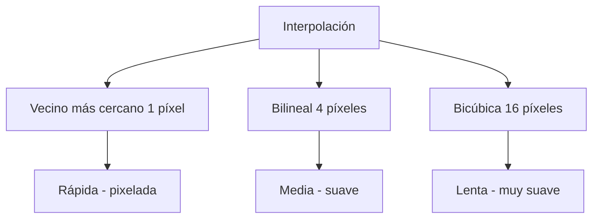

# Interpolación

## 🎯 Definición

Proceso para **estimar valores desconocidos** (píxeles que faltan) a partir de los píxeles conocidos. Se usa para completar información: al **agrandar** una imagen, **rotarla**, **corregirla** o reconstruir zonas ocultas.

> [!note] ¿Por qué hace falta?
> El cerebro humano "completa" lo que falta: si vemos a una persona escondida detrás de un poste, la **reconstruimos** mentalmente. Una computadora no puede hacer eso por sí sola: hay que **calcular** los valores que faltan con interpolación.

## 🧮 Los 3 métodos principales

### 1. Vecino más cercano (nearest neighbor)

- Toma el píxel conocido **más cercano** y le copia su valor.
- Es el **más rápido y simple**.
- Produce bordes "escalonados" o pixelados (baja calidad visual).

### 2. Bilineal (bilinear)

- Toma los **4 píxeles más cercanos** (una cruz / matriz 2×2).
- Calcula un promedio **ponderado por distancia** usando las aristas de esa matriz.
- Más suave que el vecino más cercano; costo moderado.

### 3. Bicúbica (bicubic)

- Toma los **16 vecinos más cercanos** (matriz 4×4).
- Aplica un polinomio cúbico para estimar el valor.
- Es la **más suave y precisa**, pero la **más costosa** en cómputo.

## ✅ Conclusión

- **Más vecinos y más complejidad = mejor calidad, pero mayor costo**.
- La elección depende del uso:
  - Tiempo real / rendimiento → **vecino más cercano**.
  - Calidad visual → **bicúbica**.
  - Equilibrio → **bilineal**.

## 🔗 Relacionado

- [[Resolución de Imagen]] — al cambiar la resolución (agrandar/reducir) se necesita interpolar
- [[Reducción de Niveles de Gris]] — otro procesamiento de intensidades
- [[2026-08-12 - Fundamentos de Imágenes]] — clase donde se vio
- [[Inicio]] — mapa de contenidos

## 🏷️ Etiquetas

#visión-artificial #procesamiento-de-imágenes #interpolación
