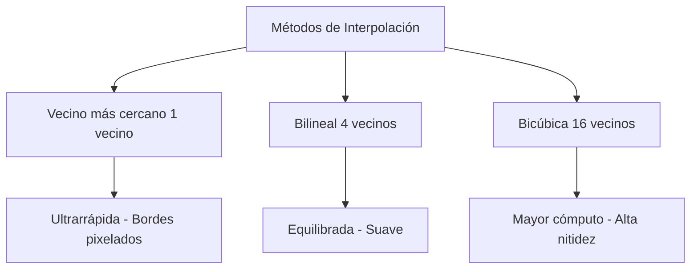

# Interpolación

## 🎯 Definición

Proceso matemático para **estimar valores desconocidos** (píxeles que faltan) a partir de un conjunto discreto de píxeles conocidos. Es una operación fundamental en visión artificial cuando se realiza:
- **Redimensionamiento espacial (escalado / upscaling / downscaling)**
- **Transformaciones geométricas (rotación, traslación, deformación afín o proyectiva)**
- **Reconstrucción y corrección de imágenes**

> [!note] Intuición
> Una imagen digital es una matriz discreta de muestras. Cuando multiplicamos sus dimensiones físicas ($3\times$), se crea una cuadrícula con espacios vacíos que la computadora debe rellenar calculando las intensidades más verosímiles a partir de los datos vecinos.

## 🧮 Mapeo de coordenadas

Al transformar una imagen de tamaño $W_{orig} \times H_{orig}$ a $W_{nuevo} \times H_{nuevo}$, cada píxel de destino $(x_{dst}, y_{dst})$ se mapea hacia atrás al espacio continuo de la imagen original:

$$ x_{src} = (x_{dst} + 0.5) \times \frac{W_{orig}}{W_{nuevo}} - 0.5 $$
$$ y_{src} = (y_{dst} + 0.5) \times \frac{H_{orig}}{H_{nuevo}} - 0.5 $$

Como $(x_{src}, y_{src})$ generalmente resulta en números decimales no enteros, se interpola el valor de intensidad evaluando los vecinos.

## 🔬 Métodos principales de interpolación

### 1. Vecino más cercano (*Nearest Neighbor*)
- Asigna al nuevo píxel el valor del píxel conocido geométricamente más próximo:
  $$ f(x, y) = f(\text{round}(x), \text{round}(y)) $$
- **Ventajas**: El más rápido computacionalmente ($O(1)$ por píxel). No inventa intensidades intermedias.
- **Desventajas**: Genera artefactos visuales severos de **pixelación y bordes escalonados (aliasing)** al agrandar.

### 2. Bilineal (*Bilinear Interpolation*)
- Utiliza los **4 vecinos más cercanos** (matriz $2 \times 2$) y realiza dos interpolaciones lineales consecutivas (horizontal y vertical):
  $$ f(x,y) \approx a x + b y + c x y + d $$
- **Ventajas**: Suaviza transiciones y reduce significativamente el efecto pixelado con bajo costo computacional.
- **Desventajas**: Puede producir ligero desenfoque en bordes de alto contraste.

### 3. Bicúbica (*Bicubic Interpolation*)
- Emplea los **16 vecinos más cercanos** (matriz $4 \times 4$) ajustando una superficie polinómica cúbica:
  $$ f(x,y) = \sum_{i=0}^3 \sum_{j=0}^3 a_{ij} x^i y^j $$
- **Ventajas**: Produce bordes más nítidos, curvas naturales y menor pérdida de textura.
- **Desventajas**: Mayor costo de cálculo (aproximadamente $4\times$ más operaciones que la bilineal).

## ⚖️ Variantes estándar vs variantes exactas (`_EXACT`)

En librerías de visión por computador como OpenCV existen variantes optimizadas y variantes exactas:

- **Estándar (`INTER_NEAREST`, `INTER_LINEAR`)**: Utilizan aproximaciones aritméticas de punto fijo para acelerar el procesamiento en tiempo real.
- **Exactas (`INTER_NEAREST_EXACT`, `INTER_LINEAR_EXACT`)**: Preservan una simetría y alineación geométrica estricta de subpíxeles.

> [!important] ¿Por qué importan las variantes exactas?
> En **procesamiento volumétrico** (e.g. tomografías, resonancias magnéticas 3D o simulaciones físicas multicapa), pequeños desplazamientos acumulativos en cada rebanada distorsionan el volumen 3D. Las variantes exactas garantizan **reproducibilidad determinista** e idéntico resultado en análisis por lotes y reconstrucciones 3D.

## ✅ Cuadro comparativo

| Método | Ventana | Complejidad | Calidad visual | Uso recomendado |
| :----- | :-----: | :---------: | :------------: | :-------------- |
| **Nearest** | $1 \times 1$ | Mínima | Baja (bloques) | Máscaras de segmentación, tiempo real estricto |
| **Bilinear** | $2 \times 2$ | Baja | Media (suave) | Escalado de uso general, streaming de video |
| **Bicubic** | $4 \times 4$ | Media | Alta (definida) | Fotografía, aumento de resolución para visualización |
| **Exact** | $1\times 1$ / $2\times 2$ | Media | Exacta | Imágenes médicas 3D, ciencia de datos determinista |

## 🔗 Relacionado

- [[Resolución de Imagen]] — al alterar la resolución espacial se requiere interpolación
- [[Tamaño de una Imagen Digital]] — impacto del redimensionamiento en el peso en bits
- [[Reducción de Niveles de Gris]] — cuantización de intensidad vs interpolación espacial
- [[2026-08-12 - Fundamentos de Imágenes]] — introducción a conceptos de interpolación
- [[2026-08-18 - Interpolación y Redimensionamiento]] — clase práctica y variantes exactas
- [[Interpolación y Redimensionamiento - Python]] — implementación con OpenCV y Matplotlib
- [[Inicio]] — mapa general de la materia

## 🏷️ Etiquetas

#visión-artificial #procesamiento-de-imágenes #interpolación #muestreo #resolución
