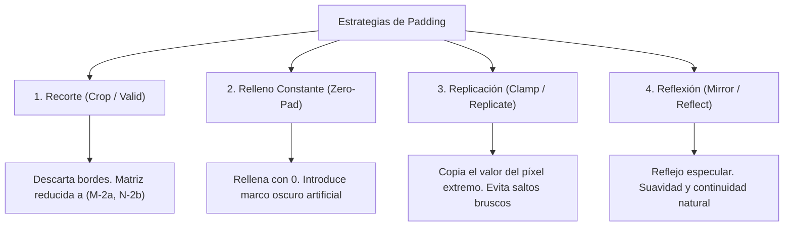

# Manejo de Bordes y Padding en Imágenes

## 🎯 El Problema de Frontera

Al deslizar un kernel de tamaño $m \times n$ (con semi-anchos $a = \frac{m-1}{2}$ y $b = \frac{n-1}{2}$) sobre una imagen, cuando el centro del kernel se posiciona sobre un píxel del borde o esquina, **parte de la máscara sobresale fuera de los límites de la matriz**:

```text
       [ ?   ?   ? ]   <- Píxeles fuera de la imagen (indefinidos)
       [ ?  P00 P01]
       [ ?  P10 P11]
```

Para evitar errores de índice fuera de rango (`out of bounds`) y definir cómo operar esos píxeles periféricos, existen **4 estrategias principales de frontera**:

---

## 🔬 Las 4 Estrategias de Manejo de Bordes



---

### 1. Recorte / Válido (*Crop / Valid Padding*)
- **Mecanismo:** El kernel únicamente se coloca en las posiciones donde cabe **completamente dentro** de la imagen original. Los píxeles de los bordes simplemente no se calculan.
- **Tamaño resultante:**
  $$ M_{salida} = M_{entrada} - 2a, \quad N_{salida} = N_{entrada} - 2b $$
  Para una imagen de $512 \times 512$ con kernel $3 \times 3$ ($a=1, b=1$), la salida es de **$510 \times 510$**.
- **Ventaja:** No inventa información artificial.
- **Desventaja:** La imagen se encoge con cada convolución sucesiva (problema crítico en redes neuronales profundas sin padding).

---

### 2. Relleno con Ceros (*Zero-Padding / Constant 0*)
- **Mecanismo:** Se crea un marco perimetral de píxeles con valor fijo $0$ (negro).
- **Ejemplo 1D:**
  $$\text{Original: } [10, 20, 30, 40] \implies \text{Con relleno: } [\mathbf{0} \mid 10, 20, 30, 40 \mid \mathbf{0}]$$
- **En OpenCV:** `cv2.BORDER_CONSTANT` con `value=0`.
- **Efecto visual / Desventaja:** Si la imagen tiene un fondo blanco o claro cerca del borde, agregar un 0 produce un salto abrupto de intensidad que un filtro de derivadas interpretará como un **falso borde fuerte** (*efecto de marco oscuro* o *ringing*).

---

### 3. Replicación / Abrazadera (*Clamp / Replicate*)
- **Mecanismo:** Se duplica el valor del píxel más externo del borde hacia afuera de manera indefinida.
- **Ejemplo 1D:**
  $$\text{Original: } [10, 20, 30, 40] \implies \text{Con relleno: } [\mathbf{10} \mid 10, 20, 30, 40 \mid \mathbf{40}]$$
- **En OpenCV:** `cv2.BORDER_REPLICATE`.
- **Ventaja:** Elimina el marco oscuro artificial; los filtros de promedio y suavizado mantienen niveles de luz coherentes en la periferia.

---

### 4. Reflexión / Espejo (*Mirror / Reflect*)
- **Mecanismo:** Se reflejan las intensidades interiores hacia afuera como si se colocara un espejo en la frontera.
- **Existen dos variantes estándar:**
  1. **Reflejo con borde duplicado (`BORDER_REFLECT`):**
     $$[\mathbf{20}, \mathbf{10} \mid 10, 20, 30, 40 \mid \mathbf{40}, \mathbf{30}]$$
  2. **Reflejo sin duplicar el borde (`BORDER_REFLECT_101` / `BORDER_DEFAULT` en OpenCV):**
     $$[\mathbf{20} \mid 10, 20, 30, 40 \mid \mathbf{30}]$$
- **Ventaja:** Proporciona la mejor **continuidad de gradiente de primer orden**, reduciendo al mínimo los artefactos en filtros de realce y derivadas.

---

## 🧮 Ejemplo Numérico Comparativo en Matriz 2D

Dada la micro-matriz $3 \times 3$:

$$ A = \begin{bmatrix} 1 & 2 & 3 \\ 4 & 5 & 6 \\ 7 & 8 & 9 \end{bmatrix} $$

Al aplicar **1 píxel de padding** con cada método:

### A. Zero-Pad (`BORDER_CONSTANT` con 0)
$$ \begin{bmatrix}
\mathbf{0} & \mathbf{0} & \mathbf{0} & \mathbf{0} & \mathbf{0} \\
\mathbf{0} & 1 & 2 & 3 & \mathbf{0} \\
\mathbf{0} & 4 & 5 & 6 & \mathbf{0} \\
\mathbf{0} & 7 & 8 & 9 & \mathbf{0} \\
\mathbf{0} & \mathbf{0} & \mathbf{0} & \mathbf{0} & \mathbf{0}
\end{bmatrix} $$

### B. Replicate (`BORDER_REPLICATE`)
$$ \begin{bmatrix}
\mathbf{1} & \mathbf{1} & \mathbf{2} & \mathbf{3} & \mathbf{3} \\
\mathbf{1} & 1 & 2 & 3 & \mathbf{3} \\
\mathbf{4} & 4 & 5 & 6 & \mathbf{6} \\
\mathbf{7} & 7 & 8 & 9 & \mathbf{9} \\
\mathbf{7} & \mathbf{7} & \mathbf{8} & \mathbf{9} & \mathbf{9}
\end{bmatrix} $$

### C. Reflect 101 (`BORDER_REFLECT_101`)
$$ \begin{bmatrix}
\mathbf{5} & \mathbf{4} & \mathbf{5} & \mathbf{6} & \mathbf{5} \\
\mathbf{2} & 1 & 2 & 3 & \mathbf{2} \\
\mathbf{5} & 4 & 5 & 6 & \mathbf{5} \\
\mathbf{8} & 7 & 8 & 9 & \mathbf{8} \\
\mathbf{5} & \mathbf{4} & \mathbf{5} & \mathbf{6} & \mathbf{5}
\end{bmatrix} $$

---

## 📊 Tabla de Resumen y Recomendaciones

| Método | Flag OpenCV | Mantiene tamaño | Continuidad visual | Cuándo usarlo |
| :----- | :---------- | :-------------: | :----------------: | :------------ |
| **Recorte** | N/A (index slicing) | ❌ No (encoge) | No aplica | Cuando no se toleran datos inventados |
| **Zero-Pad** | `cv2.BORDER_CONSTANT` | ✅ Sí | Baja (borde negro) | Visión por Deep Learning (CNNs estándar) |
| **Replicar** | `cv2.BORDER_REPLICATE` | ✅ Sí | Media | Filtros de suavizado y promedios |
| **Reflejar** | `cv2.BORDER_REFLECT_101` | ✅ Sí | Alta (suave) | Detección de bordes, gradientes, Sobel |

---

## 🔗 Relacionado

- [[Filtrado Espacial y Convolución]] — el proceso de convolución que genera la necesidad de padding
- [[Vecindad y Adyacencia de Píxeles]] — topología de píxeles periféricos
- [[2026-09-09 - Filtrado Espacial, Convolución y Manejo de Bordes]] — clase teórica
- [[Filtrado Espacial y Modos de Padding - Python]] — implementación con OpenCV
- [[Inicio]] — mapa de contenidos

---

## 🏷️ Etiquetas

#visión-artificial #procesamiento-de-imágenes #padding #bordes #convolución #efectos-frontera
