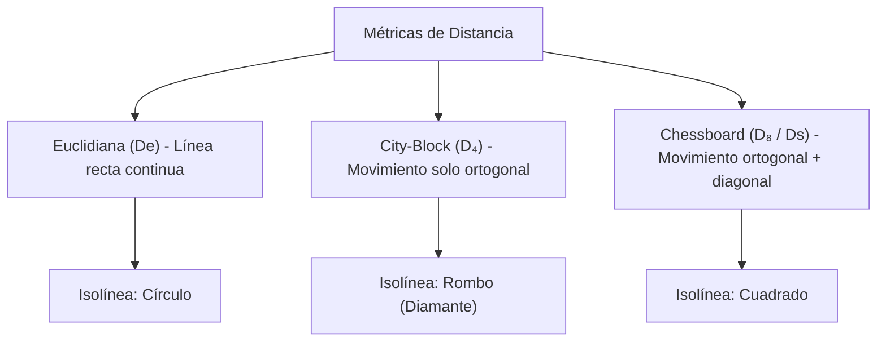

# Métricas de Distancia en Imágenes

## 🎯 Definición

Para medir la separación espacial entre dos píxeles $p(x, y)$ y $q(s, t)$ en una cuadrícula digital discreta, se emplean diferentes funciones de distancia métrica.

Para que una función $D(p, q)$ sea formalmente una **métrica de distancia**, debe cumplir 4 propiedades matemáticas:

1. **No negatividad:** $D(p, q) \ge 0$ (y $D(p, q) = 0 \iff p = q$).
2. **Simetría:** $D(p, q) = D(q, p)$.
3. **Desigualdad triangular:** $D(p, r) \le D(p, q) + D(q, r)$.

---

## 🧮 Las 3 Métricas Principales

Sean dos píxeles $p = (x, y)$ y $q = (s, t)$:

---

### 1. Distancia Euclidiana ($D_e$ o $D_E$)

Es la distancia en línea recta ordinaria en el espacio cartesiano continuo:

$$ D_e(p, q) = \sqrt{(x - s)^2 + (y - t)^2} $$

- **Geometría de isolíneas:** Los píxeles a una distancia $D_e \le r$ forman un **círculo / disco**.
- **Resultado:** Puede ser un número irracional / decimal.

---

### 2. Distancia City-Block / Manhattan / 4-Distancia ($D_4$)

Mide la distancia permitiendo únicamente movimientos ortogonales (horizontales y verticales), análogo a recorrer calles en una cuadrícula de ciudad:

$$ D_4(p, q) = |x - s| + |y - t| $$

- **Geometría de isolíneas:** Los píxeles con $D_4 \le r$ forman un **rombo (diamante)** centrado en $(x, y)$.
- **Resultado:** Siempre es un número entero.

---

### 3. Distancia Chessboard / Tablero de Ajedrez / Chebyshev ($D_8$ o $D_s$)

Mide la distancia permitiendo movimientos tanto ortogonales como diagonales, análogo al movimiento de un Rey en ajedrez (un paso en diagonal cuenta igual que un paso horizontal o vertical):

$$ D_8(p, q) = \max(|x - s|, |y - t|) $$

- **Geometría de isolíneas:** Los píxeles con $D_8 \le r$ forman un **cuadrado** centrado en $(x, y)$.
- **Resultado:** Siempre es un número entero.

---

## 🔍 Ejercicios Resueltos Paso a Paso

### 📌 Ejemplo A: $p = (1, 1)$ y $q = (4, 5)$

- $x = 1, y = 1$
- $s = 4, t = 5$
- $\Delta x = |1 - 4| = 3$
- $\Delta y = |1 - 5| = 4$

#### Cálculo de $D_e$:
$$ D_e = \sqrt{(1 - 4)^2 + (1 - 5)^2} = \sqrt{(-3)^2 + (-4)^2} = \sqrt{9 + 16} = \sqrt{25} = \mathbf{5} $$

#### Cálculo de $D_4$:
$$ D_4 = |1 - 4| + |1 - 5| = 3 + 4 = \mathbf{7} $$

#### Cálculo de $D_8$:
$$ D_8 = \max(|1 - 4|, |1 - 5|) = \max(3, 4) = \mathbf{4} $$

---

### 📌 Ejemplo B: $p = (1, 1)$ y $q = (5, 5)$

![[metricas-distancia-matriz.png]]

- $x = 1, y = 1$
- $s = 5, t = 5$
- $\Delta x = |1 - 5| = 4$
- $\Delta y = |1 - 5| = 4$
- Parámetro $\Delta = 4$

#### Cálculo de $D_e$:
$$ D_e = \sqrt{(1 - 5)^2 + (1 - 5)^2} = \sqrt{(-4)^2 + (-4)^2} = \sqrt{16 + 16} = \sqrt{32} \approx \mathbf{5.66} $$

#### Cálculo de $D_4$:
$$ D_4 = |1 - 5| + |1 - 5| = 4 + 4 = \mathbf{8} $$

#### Cálculo de $D_8$ ($D_s$):
$$ D_8 = \max(|1 - 5|, |1 - 5|) = \max(4, 4) = \mathbf{4} $$

---

## 📊 Relación y orden de magnitud entre distancias

Para cualquier par de píxeles $p$ y $q$:

$$ D_8(p, q) \le D_e(p, q) \le D_4(p, q) $$

| Característica | Euclidiana ($D_e$) | City-Block ($D_4$) | Chessboard ($D_8$) |
| :------------- | :----------------: | :----------------: | :----------------: |
| **Tipo de movimiento** | Continuo euclidiano | Ortogonal (4-vecindad) | Ortogonal + Diagonal (8-vecindad) |
| **Costo computacional** | Alto (raíz cuadrada) | Muy bajo (sumas de enteros) | Mínimo (comparación) |
| **Forma de la frontera** | Circular | Romboidal | Cuadrada |
| **Uso típico** | Geometría exacta | Procesamiento ortogonal | Morfología y dilatación rápida |

---

## 🔗 Relacionado

- [[Vecindad y Adyacencia de Píxeles]] — cómo los caminos determinan la conectividad
- [[Tamaño de una Imagen Digital]] — cuadrículas y coordenadas $(N \times M)$
- [[2026-08-19 - Relaciones entre Píxeles y Métricas de Distancia]] — clase donde se vieron los ejemplos
- [[Métricas de Distancia y Conectividad - Python]] — implementación de cálculo numérico
- [[Inicio]] — mapa de contenidos

---

## 🏷️ Etiquetas

#visión-artificial #procesamiento-de-imágenes #métricas #distancias #euclidiana #manhattan #chebyshev
