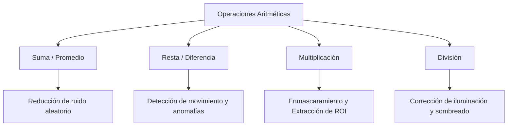

# Operaciones Aritméticas entre Imágenes

## 🎯 Definición

Las operaciones aritméticas en procesamiento digital de imágenes se ejecutan **píxel a píxel** (*point operations*) entre dos o más imágenes $f_1$ y $f_2$ de **iguales dimensiones** ($M \times N$), produciendo una nueva imagen resultante $g$:

$$ g(x, y) = f_1(x, y) \circ f_2(x, y) \quad \text{donde } \circ \in \{+, -, \times, \div\} $$

---

## 🧮 Operaciones Principales y Casos de Uso

---

### 1. Suma y Promedio de Imágenes ($f_1 + f_2$)

- **Propósito principal:** Reducción y eliminación de **ruido aleatorio / gaussiano**.
- **Fundamento teórico:** Si capturamos una escena estática $K$ veces, la señal pura $s(x, y)$ se mantiene constante mientras que el ruido $n_i(x, y)$ es estocástico con media cero ($E[n] = 0$). Al promediar:
  $$ \bar{g}(x, y) = \frac{1}{K} \sum_{i=1}^K f_i(x, y) = s(x, y) + \frac{1}{K} \sum_{i=1}^K n_i(x, y) $$
  La varianza del ruido se reduce por un factor de $\frac{1}{K}$, mejorando notablemente la relación señal a ruido (SNR).

---

### 2. Resta de Imágenes ($|f_1 - f_2|$)

- **Propósito principal:** Detección de movimiento, seguimiento de objetos y sustracción de fondo estático.
- **Fórmula:**
  $$ d(x, y) = |f_1(x, y) - f_2(x, y)| $$
- **Comportamiento:** Los píxeles idénticos (elementos fijos del fondo) dan como resultado $0$ (negro). Los elementos que han cambiado o se han desplazado entre fotogramas dan valores mayores a cero, aislando el elemento móvil.

---

### 3. Multiplicación de Imágenes ($f_1 \times f_2$)

- **Propósito principal:** **Enmascaramiento** y extracción de **Regiones de Interés (ROI)**.
- **Comportamiento:** Al multiplicar una imagen en escala de grises $f(x, y)$ por una máscara binaria $m(x, y) \in \{0, 1\}$:
  - Píxeles multiplicados por $0 \to 0$ (fondo eliminado/apagado).
  - Píxeles multiplicados por $1 \to f(x, y)$ (área de interés preservada sin alteración).

---

### 4. División de Imágenes ($f_1 / f_2$)

- **Propósito principal:** **Corrección de iluminación no uniforme (*Shading Correction*)** y calibración de defectos de sensor.
- **Comportamiento:** Si un sensor tiene viñeteado (esquinas más oscuras que el centro) o iluminación desbalanceada, se divide la imagen capturada entre una imagen patrón de fondo blanco/iluminación homogénea para nivelar el brillo en toda la superficie.

---

## ⚠️ Reto del Rango Dinámico

Al operar imágenes en `uint8` (rango $0 - 255$):
- Las sumas pueden superar 255 $\to$ **Desbordamiento**.
- Las restas pueden generar valores negativos $\to$ **Underflow**.
- Para solucionar esto se recurre a saturación (`cv2.add`), mezcla ponderada (`cv2.addWeighted`) o [[Desbordamiento y Normalización de Imágenes]].

---

## 🔗 Relacionado

- [[Desbordamiento y Normalización de Imágenes]] — clipping vs normalización min-max
- [[Operaciones Lógicas y Álgebra Booleana en Imágenes]] — operaciones en imágenes binarias
- [[Resolución de Imagen]] — cuantización y profundidad de bits
- [[2026-09-01 - Operaciones Aritméticas y Lógicas entre Imágenes]] — clase teórica y práctica
- [[Operaciones Aritméticas y Normalización - Python]] — implementación en código
- [[Inicio]] — mapa de contenidos

---

## 🏷️ Etiquetas

#visión-artificial #procesamiento-de-imágenes #operaciones-aritméticas #suma-de-imágenes #resta-de-imágenes
