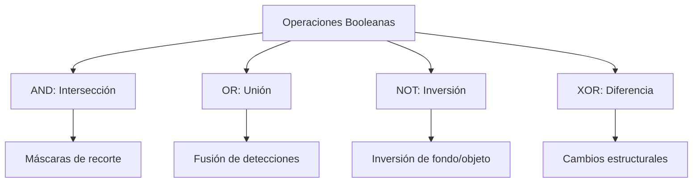

# Operaciones Lógicas y Álgebra Booleana en Imágenes

## 🎯 Definición

Las operaciones lógicas se aplican píxel a píxel sobre **imágenes binarizadas** (donde cada píxel toma valores $0$ para el fondo y $1$ para el primer plano/objeto), o bien a nivel de bits (*bit-plane slicing*) en imágenes en escala de grises.

---

## 🧮 Operadores Booleanos Principales

Sean dos imágenes binarias $A$ y $B$:

| Operador | Símbolo lógico | Función en Visión Artificial | Descripción |
| :------- | :------------: | :--------------------------- | :---------- |
| **AND** | $A \cap B$ | **Intersección** | Conserva únicamente los píxeles activos simultáneamente en ambas imágenes (enmascaramiento). |
| **OR** | $A \cup B$ | **Unión** | Combina regiones de interés detectadas en distintas tomas o sensores. |
| **NOT** | $\bar{A}$ / $A^c$ | **Complemento / Negativo** | Invierte el fondo y el primer plano ($0 \to 1, 1 \to 0$). |
| **XOR** | $A \oplus B$ | **Diferencia Simétrica** | Resalta áreas donde una sola de las dos imágenes está activa (detección de diferencias estructurales). |

---

## 🔍 Aplicación en Enmascaramiento

La combinación de álgebra booleana con operaciones aritméticas permite segmentar y extraer regiones complejas sin tocar el resto de la matriz:

1. Crear máscara binaria $M$ (con umbralización o contornos).
2. Aplicar `cv2.bitwise_and(img, img, mask=M)`.

---

## 🔗 Relacionado

- [[Operaciones Aritméticas entre Imágenes]] — punto a punto aritmético
- [[Vecindad y Adyacencia de Píxeles]] — conectividad en máscaras binarias
- [[2026-09-01 - Operaciones Aritméticas y Lógicas entre Imágenes]] — clase teórica
- [[Inicio]] — mapa de contenidos

---

## 🏷️ Etiquetas

#visión-artificial #procesamiento-de-imágenes #lógica-binaria #máscaras
