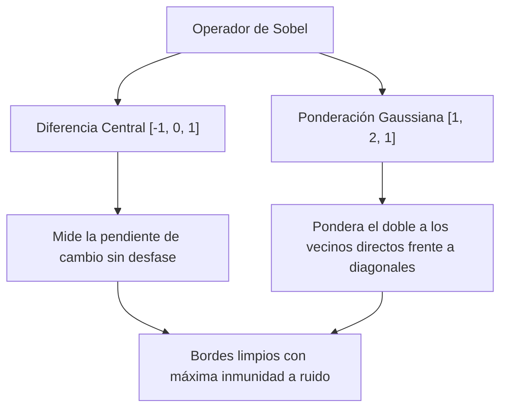

# Operadores de Gradiente — Roberts, Prewitt y Sobel

## 🎯 Definición

Los **operadores de gradiente de primer orden** son máscaras de convolución espacial que aproximan las componentes del vector gradiente $\nabla f = [G_x, G_y]^T$. Su objetivo es detectar **bordes y discontinuidades de luminancia**, midiendo la magnitud y orientación de las variaciones locales de intensidad.

---

## 🧮 1. Operador Cruzado de Roberts (1963)

Aproxima las derivadas en direcciones diagonales ortogonales a $45^\circ$ y $135^\circ$ utilizando ventanas mínimas de $2 \times 2$:

$$ G_x = \begin{bmatrix} +1 & 0 \\ 0 & -1 \end{bmatrix}, \qquad G_y = \begin{bmatrix} 0 & +1 \\ -1 & 0 \end{bmatrix} $$

- **Fórmulas de convolución:**
  $$ G_x = z_9 - z_5, \qquad G_y = z_8 - z_6 $$
- **Limitaciones críticas:**
  1. Carece de un **píxel ancla central único** en coordenadas enteras (el centro cae entre cuatro píxeles).
  2. No incorpora ningún suavizado espacial: es extremadamente vulnerable al ruido aleatorio.

---

## 🧮 2. Operador de Prewitt (1970)

Introduce una ventana simétrica de $3 \times 3$ centrada en $(0, 0)$. Combina una diferencia finita central en una dirección con un **suavizado promedio uniforme** en la dirección ortogonal:

$$ G_x = \begin{bmatrix} -1 & 0 & +1 \\ -1 & 0 & +1 \\ -1 & 0 & +1 \end{bmatrix} = \begin{bmatrix} 1 \\ 1 \\ 1 \end{bmatrix} \begin{bmatrix} -1 & 0 & +1 \end{bmatrix} $$

$$ G_y = \begin{bmatrix} -1 & -1 & -1 \\ 0 & 0 & 0 \\ +1 & +1 & +1 \end{bmatrix} = \begin{bmatrix} -1 \\ 0 \\ +1 \end{bmatrix} \begin{bmatrix} 1 & 1 & 1 \end{bmatrix} $$

- **Efecto de diseño:** La fila horizontal $[-1, 0, +1]$ calcula la derivada horizontal, mientras que el vector vertical $[1, 1, 1]^T$ promedia las tres líneas adyacentes para suprimir ruido de alta frecuencia.

---

## 🧮 3. Operador de Sobel (1968)

Mejora el operador de Prewitt sustituyendo el promedio plano por una **aproximación Gaussiana ponderada** $[1, 2, 1]^T$:

$$ G_x = \begin{bmatrix} -1 & 0 & +1 \\ -2 & 0 & +2 \\ -1 & 0 & +1 \end{bmatrix} = \begin{bmatrix} 1 \\ 2 \\ 1 \end{bmatrix} \begin{bmatrix} -1 & 0 & +1 \end{bmatrix} $$

$$ G_y = \begin{bmatrix} -1 & -2 & -1 \\ 0 & 0 & 0 \\ +1 & +2 & +1 \end{bmatrix} = \begin{bmatrix} -1 \\ 0 \\ +1 \end{bmatrix} \begin{bmatrix} 1 & 2 & 1 \end{bmatrix} $$

> [!important] ¿Por qué el peso 2 en el centro?
> En una cuadrícula $3 \times 3$, los vecinos horizontales/verticales están a distancia euclidiana $d = 1.0$, mientras que los diagonales están a $d = \sqrt{2} \approx 1.414$. Ponderar con $[1, 2, 1]$ compensa esta disparidad geométrica, preservando mejor la isotropía espacial.

---

## 📐 Cálculo del Vector Gradiente

A partir de $G_x$ y $G_y$:

1. **Magnitud del Gradiente (Fuerza del borde):**
   $$ M(x, y) = \|\nabla f\| = \sqrt{G_x^2 + G_y^2} \quad \approx |G_x| + |G_y| \quad \text{(Aproximación rápida de Manhattan)} $$
2. **Dirección del Gradiente (Orientación ortogonal):**
   $$ \theta(x, y) = \arctan\left(\frac{G_y}{G_x}\right) $$

---

## 📊 Matriz Comparativa

| Propiedad | Roberts | Prewitt | Sobel |
| :--- | :---: | :---: | :---: |
| **Dimensiones** | $2 \times 2$ | $3 \times 3$ | $3 \times 3$ |
| **Píxel central** | No | Sí | Sí |
| **Suavizado transversal** | Ninguno | Promedio plano $[1, 1, 1]$ | **Aproximación Gaussiana $[1, 2, 1]$** |
| **Robustez ante ruido** | Muy baja | Media | **Alta** |
| **Dirección detectada** | Diagonales $\pm 45^\circ$ | Ejes $X$ e $Y$ | **Ejes $X$ e $Y$ (con mayor precisión angular)** |
| **Costo computacional** | 4 ops/px | 6 ops/px (separable) | 6 ops/px (separable) |

---

## 🔗 Relacionado

- [[Derivadas Espaciales en Imágenes]] — fundamentos de la primera y segunda derivada
- [[Filtros de Suavizado Espacial]] — separabilidad y filtrado Gaussiano
- [[Filtrado Espacial y Convolución]] — convolución bidimensional
- [[2026-10-07 - Operadores de Gradiente - Roberts, Prewitt y Sobel]] — clase teórica
- [[Operadores de Gradiente - Roberts, Prewitt y Sobel - Python]] — código en OpenCV
- [[Inicio]] — mapa general de la materia

---

## 🏷️ Etiquetas

#visión-artificial #procesamiento-de-imágenes #detección-de-bordes #gradiente #roberts #prewitt #sobel
