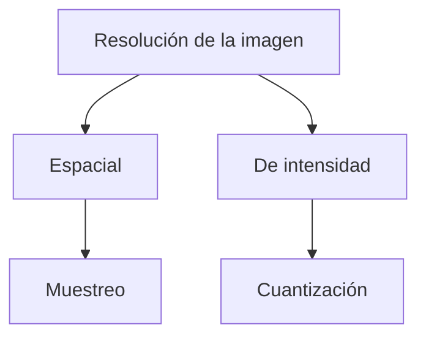

# Resolución de Imagen

## 🎯 Definición

La resolución de una imagen tiene **dos componentes que se pueden modificar de forma independiente**:

1. **Resolución espacial** → la define el **muestreo** (cuántos píxeles capturo).
2. **Resolución de intensidad** → la define la **cuantización** (cuántos niveles de gris uso).

## 🧠 Muestreo → resolución espacial

- Es la **cantidad de píxeles** que se toman por unidad de área (píxeles por pulgada, ppp/dpi).
- **A más píxeles por pulgada**, la imagen se ve más nítida y clara.
- Determina el nivel de **detalle físico** que se puede representar:
  - **Alta frecuencia de muestreo** → los píxeles están muy juntos en la parcela → se distinguen detalles finos (ej: saber si una persona tiene el cabello rizado o liso en una foto).
  - **Baja frecuencia** → los píxeles no se tocan tan rápido → la imagen se ve **borrosa o irreconocible**.
- La *frecuencia* describe qué tan rápido alternan los tonos (claro/oscuro) entre parcelas de píxeles.

## 🧠 Cuantización → resolución de intensidad

- Define **cuántos niveles de gris** puede tener la imagen ($L = 2^k$).
- Es la cantidad de **diferencias de representación del color** disponibles:
  - Muchos niveles → escala de grises extensa y suave.
  - Poca cuantización (ej: solo 4 niveles) → la imagen parece de "4 colores" o efecto cartel.
- Va desde niveles casi infinitos de blanco a negro hasta una cuantización pobre.

## 🧮 Las dos variables se relacionan

- **Influyen juntas** en la calidad de imagen y en el rendimiento.
- **Se pueden modificar de manera independiente**: puedo cambiar píxeles sin tocar niveles, y viceversa.
- **Costo**: con muchos píxeles, procesar cada uno cuesta más (mayor rendimiento exigido).

> [!example] Casos de uso según prioridad
> - **Reconocimiento facial**: importa más la resolución **espacial** (capturar detalles finos del rostro) que tener muchísimos niveles de gris.
> - **Radiografías / imágenes médicas**: importa más la resolución de **intensidad** (distinguir muchos tonos de gris para ver tejidos).
> - **Íconos o logos**: se ven bien con pocos niveles; se prioriza el **rendimiento**.
> - **Videos en streaming**: se equilibran ambas para que el procesamiento no se dispare.

## ✅ Conclusión

- **Muestreo** = cuántos píxeles → detalle espacial.
- **Cuantización** = cuántos niveles → detalle de intensidad.
- La calidad final depende de ambas, pero se ajustan por separado según el caso de uso y el rendimiento.

## 🔗 Relacionado

- [[Reducción de Niveles de Gris]] — la cuantización aplicada
- [[Tamaño de una Imagen Digital]] — $b = N \times M \times k$
- [[Interpolación]] — cómo se estima la información que falta
- [[2026-08-12 - Fundamentos de Imágenes]] — clase donde se vio
- [[Inicio]] — mapa de contenidos

## 🏷️ Etiquetas

#visión-artificial #procesamiento-de-imágenes #resolución #muestreo #cuantización
