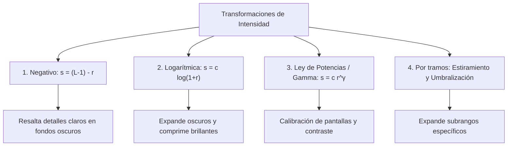

# Transformaciones de Intensidad Espacial

## 🎯 Definición

En el dominio espacial, las funciones de transformación de intensidad son operaciones **puntuales directas** que mapean el nivel de gris de entrada $r$ al nivel de gris de salida $s$ mediante una función de transferencia $T$:

$$ s = T(r) \quad \text{con } r, s \in [0, L-1] $$

Estas operaciones son independientes de la posición $(x, y)$ del píxel y de sus vecinos locales ($1 \times 1$).

---

## 🔬 Las 4 Transformaciones Fundamentales

### 1. Inversión Fotográfica / Negativo de Imagen
Invierte la escala de grises de modo que los valores oscuros se vuelven claros y viceversa:

$$ s = (L - 1) - r $$

- Para imágenes de 8 bits ($L = 256$): $s = 255 - r$.
- **Aplicación clínica/industrial:** Resalta estructuras vasculares finas, microcalcificaciones en mamografías y detalles en radiografías.

---

### 2. Transformación Logarítmica
Mapea una escala estrecha de niveles bajos de intensidad en un rango de salida mucho más amplio, mientras comprime las intensidades altas:

$$ s = c \cdot \log(1 + r) \quad \text{con } c = \frac{L - 1}{\log(1 + r_{\max})} $$

> [!important] ¿Por qué se suma 1 dentro del logaritmo?
> Debido a que $\log(0) = -\infty$, la expresión $1 + r$ asegura que para el nivel de entrada mínimo $r = 0$, la salida sea estrictamente $\log(1) = 0$.

- **Aplicación:** Visualización del **Espectro de Fourier**, donde el rango dinámico de frecuencias puede abarcar de $0$ a $10^6$.

---

### 3. Transformación de Ley de Potencias / Corrección Gamma
Modela la respuesta no lineal de dispositivos de visualización (monitores CRT/OLED) y captura de sensores:

$$ s = c \cdot r^\gamma $$

- **Caso $\gamma < 1$ (Curva convexa):** Expande los tonos oscuros y aclara la imagen general (efecto similar al logarítmico pero ajustable).
- **Caso $\gamma > 1$ (Curva cóncava):** Comprime los tonos oscuros y oscurece la imagen, aumentando el contraste en zonas brillantes.
- **Caso $\gamma = 1$:** Transformación lineal directa (identidad).

---

### 4. Estiramiento de Contraste por Tramos (*Piecewise-Linear*)
Ajusta rangos arbitrarios mediante una función continua por trozos para maximizar la visibilidad de características:

$$ s = \begin{cases} 
\frac{s_1}{r_1} r & 0 \le r < r_1 \\
\frac{s_2 - s_1}{r_2 - r_1}(r - r_1) + s_1 & r_1 \le r \le r_2 \\
\frac{(L-1) - s_2}{(L-1) - r_2}(r - r_2) + s_2 & r_2 < r \le L-1 
\end{cases} $$

- **Umbralización (*Thresholding*):** Caso límite donde $r_1 = r_2 = T_{umbral}$, $s_1 = 0$ y $s_2 = L-1$, produciendo una imagen binaria ($0$ y $255$).

---

## 🔗 Relacionado

- [[Histogramas y Ecualización de Imagen]] — redistribución estadística de intensidades
- [[Desbordamiento y Normalización de Imágenes]] — ajuste de rango dinámico
- [[2026-09-02 - Transformaciones de Intensidad y Procesamiento de Histogramas]] — clase correspondiente
- [[Transformaciones de Intensidad y Histogramas - Python]] — scripts en OpenCV y NumPy
- [[Inicio]] — mapa general de la materia

---

## 🏷️ Etiquetas

#visión-artificial #procesamiento-de-imágenes #transformaciones-espaciales #corrección-gamma #negativo #estiramiento-contraste
