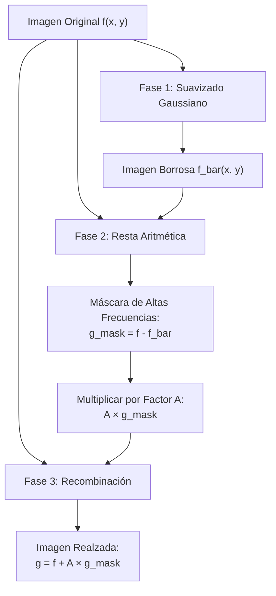
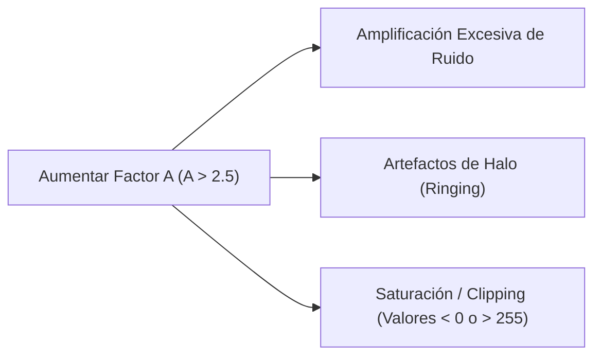

# Unsharp Masking y High-Boost Filtering

## 🎯 Definición

**Unsharp Masking (Máscara de Desenfoque)** y **High-Boost Filtering (Filtrado de Alto Realce)** son técnicas lineales del dominio espacial diseñadas para aumentar la **nitidez aparente y acutancia** de una imagen mediante la extracción y amplificación controlada de sus componentes de alta frecuencia (bordes y detalles).

A diferencia de la diferenciación pura (como el Laplaciano directo), logran un realce de bordes estable combinando una versión suavizada con la imagen original.

---

## 🧮 El Algoritmo en 3 Fases

### 1. Fase 1: Suavizado (Paso Bajo)
Se desenfoca la imagen original $f$ mediante un filtro espacial paso bajo (típicamente Gaussiano con parámetro $\sigma$):
$$ \bar{f}(x, y) = f(x, y) * G_\sigma(x, y) $$

### 2. Fase 2: Creación de la Máscara de Detalle
Se extraen las altas frecuencias restando la imagen desenfocada:
$$ g_{mask}(x, y) = f(x, y) - \bar{f}(x, y) $$
- **Zonas planas homogéneas:** $f \approx \bar{f} \implies g_{mask} \approx 0$.
- **Bordes y cambios bruscos:** $f \neq \bar{f} \implies g_{mask}$ contiene los picos de transición positiva y negativa.

### 3. Fase 3: Ponderación y Recombinación
Se suma la máscara escalada a la imagen original:
$$ g(x, y) = f(x, y) + A \cdot g_{mask}(x, y) $$

---

## ⚖️ El Factor $A$: Clasificación de Respuestas

| Valor de $A$ | Nombre de la Técnica | Comportamiento Visual |
| :---: | :--- | :--- |
| **$A = 1$** | **Unsharp Masking Estándar** | Realce balanceado y natural. Muy utilizado en edición fotográfica y escaneado. |
| **$A > 1$** | **High-Boost Filtering** | Mayor énfasis en los detalles finos. Corrige imágenes muy borrosas o desenfocadas de fábrica. |
| **$0 < A < 1$** | **Realce Atenuado** | Intervención sutil cuando la imagen de entrada ya presenta algo de ruido. |

> [!tip] Formulación Clásica Alternativa (Gonzalez & Woods)
> En algunos textos, el filtrado High-Boost se formula expresando la imagen de salida como:
> $$ g(x, y) = A \cdot f(x, y) - \bar{f}(x, y) = (A - 1) f(x, y) + g_{mask}(x, y) $$
> Ambas formulaciones son equivalentes, ya que controlan el balance entre la señal base y las altas frecuencias.

---

## 👁️ Fenómeno Perceptivo: Bandas de Mach y Acutancia

El cerebro humano evalúa la nitidez de una imagen no solo por su resolución, sino por el **contraste local en los bordes**:
- Al sumar la máscara a la imagen original, se produce un pico brillante adicional en el lado claro del borde (**sobreimpulso**) y un valle oscuro en el lado sombreado (**bajoimpulso**).
- Esto estimula las células de inhibición lateral en la retina humana (el efecto de las *Bandas de Mach*), haciendo que el contorno se perciba notablemente más nítido y tridimensional.

---

## ⚠️ El Costo Oculto y su Solución

### Solución: Unsharp Masking con Umbral (*Thresholding*)
Para evitar amplificar el grano en zonas planas, se aplica la máscara únicamente cuando la magnitud del borde supera un umbral mínimo $T$:

$$ g(x, y) = \begin{cases} 
f(x, y) + A \cdot g_{mask}(x, y) & \text{si } |g_{mask}(x, y)| \ge T \\
f(x, y) & \text{si } |g_{mask}(x, y)| < T 
\end{cases} $$

---

## 🔗 Relacionado

- [[Derivadas Espaciales en Imágenes]] — operador Laplaciano como alternativa diferencial
- [[Filtros de Suavizado Espacial]] — filtro Gaussiano como base del desenfoque
- [[Filtrado Espacial y Convolución]] — fundamentos de máscaras
- [[2026-09-30 - Realce de Imágenes: Unsharp Masking y High-Boost Filtering]] — clase teórica
- [[Unsharp Masking y High-Boost - Python]] — código ejecutable
- [[Inicio]] — mapa general de la materia

---

## 🏷️ Etiquetas

#visión-artificial #procesamiento-de-imágenes #unsharp-masking #high-boost #realce-de-bordes #nitidez #acutancia
