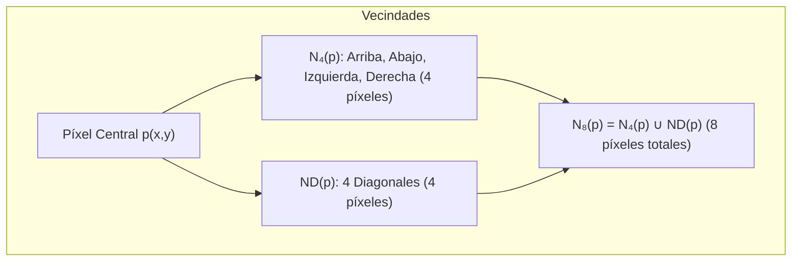

# Vecindad y Adyacencia de Píxeles

## 🎯 Definición

En una imagen digital, las relaciones espaciales entre píxeles determinan cómo se identifican bordes, contornos, regiones conexas y objetos. 

> [!important] Principio fundamental
> **La proximidad espacial por sí sola NO implica conexión.**
> Para que dos píxeles estén realmente conectados (adyacentes), se requieren dos condiciones simultáneas:
> 1. **Proximidad espacial:** Deben ser vecinos en la cuadrícula.
> 2. **Similitud de intensidad:** Sus niveles de gris o color deben pertenecer a un conjunto definido de valores de interés $V$.

---

## 🧠 1. Tipos de Vecindades de un Píxel $p(x, y)$

Dado un píxel central $p$ con coordenadas $(x, y)$:

### A. 4-Vecinos / Vecindad Ortogonal ($N_4(p)$)
Son los 4 píxeles situados en posición vertical y horizontal directa:
$$ N_4(p) = \{(x+1, y), (x-1, y), (x, y+1), (x, y-1)\} $$
- Cada vecino en $N_4(p)$ está a una distancia exacta de 1 unidad del centro.

### B. Vecinos Diagonales ($N_D(p)$ o $N_0(p)$)
Son los 4 píxeles ubicados en las esquinas diagonales:
$$ N_D(p) = \{(x+1, y+1), (x+1, y-1), (x-1, y+1), (x-1, y-1)\} $$
- Cada vecino en $N_D(p)$ está a una distancia euclidiana de $\sqrt{2} \approx 1.414$ unidades.

### C. 8-Vecinos / Vecindad Completa ($N_8(p)$)
Es la unión de los vecinos ortogonales y diagonales que rodean por completo al píxel:
$$ N_8(p) = N_4(p) \cup N_D(p) $$

> [!warning] Casos en los límites de la imagen
> Si el píxel $p(x, y)$ se encuentra en el borde o en una esquina de la matriz:
> - En una **esquina**: Solo tiene **2** vecinos en $N_4$, **1** en $N_D$, y **3** en $N_8$.
> - En un **borde**: Solo tiene **3** vecinos en $N_4$, **2** en $N_D$, y **5** en $N_8$.

---

## 🧮 2. Adyacencia y el Conjunto de Intensidades $V$

El conjunto $V$ define los valores de brillo/intensidad que consideramos "similares" o pertenecientes al mismo objeto. Por ejemplo:
- En imágenes binarias: $V = \{1\}$ (solo píxeles de primer plano).
- En escala de grises: $V = \{128, 129, \dots, 255\}$ (rango de brillos altos).

### Tipos de Adyacencia:

1. **4-Adyacencia**: Dos píxeles $p$ y $q$ con valores en $V$ son 4-adyacentes si:
   $$ q \in N_4(p) $$

2. **8-Adyacencia**: Dos píxeles $p$ y $q$ con valores en $V$ son 8-adyacentes si:
   $$ q \in N_8(p) $$

3. **$m$-Adyacencia (Adyacencia Mixta)**:
   Dos píxeles $p$ y $q$ con valores en $V$ son $m$-adyacentes si:
   - **(a)** $q \in N_4(p)$, **Ó**
   - **(b)** $q \in N_D(p)$ **Y** el conjunto intersección $N_4(p) \cap N_4(q)$ **no contiene ningún píxel con valor en $V$**.

> [!important] ¿Por qué surge la $m$-adyacencia?
> La 8-adyacencia suele generar **ambigüedad topológica** porque crea múltiples caminos o bucles cerrados entre dos píxeles cercanos. La **$m$-adyacencia elimina rutas redundantes** obligando a que solo exista un camino único no ambiguo.

---

## 🔍 Ejemplo Visual de Evaluación de Adyacencia

![[adyacencia-y-vecinos-ejemplo.png]]

Considerando $V = \{1\}$:
- El píxel central con valor **2** no pertenece a $V$, por lo que no puede formar adyacencia directa bajo este criterio.
- Los píxeles adyacentes evaluados abajo comparten el valor $1 \in V$, permitiendo establecer un camino conexo.

---

## 🛣️ 3. Caminos (*Paths*), Conectividad y Regiones

- **Camino (Path)**: Secuencia de píxeles distintos $(x_0, y_0), (x_1, y_1), \dots, (x_n, y_n)$ donde cada par $(x_{i}, y_{i})$ y $(x_{i-1}, y_{i-1})$ es adyacente según el criterio elegido (4, 8 o $m$).
- **Longitud del camino**: Es el número de pasos $n$ requeridos para ir del píxel inicial al final.
- **Componente Conexa**: Subconjunto de píxeles de una imagen donde existe al menos un camino que une cualquier par de píxeles dentro del subconjunto.
- **Frontera / Contorno (*Boundary*)**: Conjunto de píxeles de una región que tienen al menos un vecino que pertenece al fondo (típicamente evaluado con 8-conectividad para garantizar contornos cerrados sin huecos).

---

## ✅ Conclusión

- $N_4$ y $N_8$ describen vecindad puramente espacial.
- La **adyacencia** combina vecindad con el conjunto $V$.
- La **$m$-adyacencia** es la solución estándar para evitar caminos alternativos espurios en análisis de formas y segmentación.

---

## 🔗 Relacionado

- [[Métricas de Distancia en Imágenes]] — cómo medir distancias sobre estos caminos
- [[Resolución de Imagen]] — discretización de la cuadrícula espacial
- [[2026-08-19 - Relaciones entre Píxeles y Métricas de Distancia]] — clase donde se desarrolló
- [[Inicio]] — mapa general de la materia

---

## 🏷️ Etiquetas

#visión-artificial #procesamiento-de-imágenes #vecindad #adyacencia #conectividad
