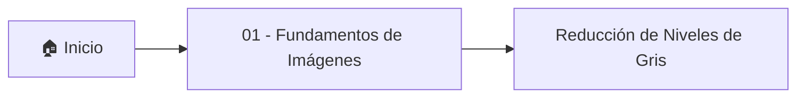

# 🎓 Visión Artificial

> [!info] Materia electiva
> Bóveda de apuntes de la electiva **Visión Artificial**.
> Notas atómicas organizadas por unidades y enlazadas entre sí mediante wikilinks.

## 📚 Unidades

### 01 — Fundamentos de Imágenes
- [[Reducción de Niveles de Gris]] — cuantización de 256 a 8 niveles de gris

## 🗺️ Estructura de la bóveda

## 🛠️ Plantillas
- [[Nota de Clase]] — úsala como base para cada apunte nuevo (`Ctrl/Cmd + P` → *Insertar plantilla*)

## 🏷️ Etiquetas principales
- `#visión-artificial`
- `#procesamiento-de-imágenes`
- `#niveles-de-gris`
