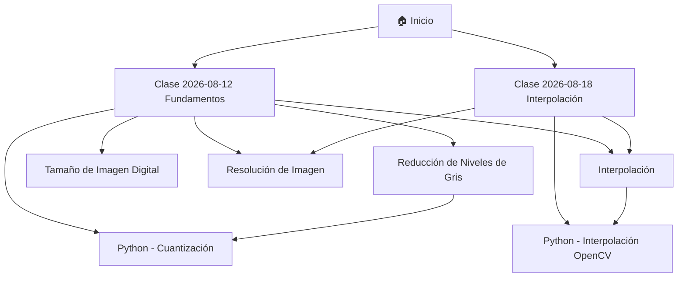

# 🎓 Visión Artificial

> [!info] Materia electiva
> Bóveda de apuntes de la electiva **Visión Artificial**.
> Organizada por **clases** (con fecha), **conceptos** (notas atómicas) y **código** (scripts explicados paso a paso), todo enlazado bidireccionalmente con wikilinks.

## 📅 Clases (por fecha)

> [!tip] Convención
> Cada clase se guarda en `Clases/` con el formato `YYYY-MM-DD - Título` para que se ordenen cronológicamente de forma automática.

- [[2026-08-12 - Fundamentos de Imágenes]] — fundamentos, niveles de gris, resolución y Python (Colab)
- [[2026-08-18 - Interpolación y Redimensionamiento]] — escalado $3\times$, interpolación (Nearest, Linear, Cubic, Exact) y Zoom en OpenCV

## 🧠 Conceptos

- [[Reducción de Niveles de Gris]] — cuantización de 256 a 8 niveles
- [[Tamaño de una Imagen Digital]] — $b = N \times M \times k$ y $k = \log_2(L)$
- [[Resolución de Imagen]] — muestreo (espacial) vs cuantización (intensidad)
- [[Interpolación]] — vecino más cercano, bilineal, bicúbica y variantes exactas

## 💻 Código

- [[Reducción de Niveles de Gris - Python]] — cuantización a 64, 20, 8 y 2 niveles con NumPy y Pillow
- [[Interpolación y Redimensionamiento - Python]] — redimensionamiento con `cv2.resize`, métodos clásicos y variantes `_EXACT` con inspección por zoom

## 🗺️ Estructura de la bóveda



## 🛠️ Plantillas

- [[Plantilla de Clase]] — apuntes por sesión (con fecha)
- [[Plantilla de Concepto]] — notas atómicas por tema
- [[Plantilla de Código]] — scripts explicados

## 📌 ¿Cómo uso esta bóveda?

1. **Nueva clase** → usa [[Plantilla de Clase]] y nombra la nota `YYYY-MM-DD - Tema`.
2. **Concepto nuevo** → nota atómica en `Conceptos/` con la [[Plantilla de Concepto]].
3. **Código nuevo** → nota en `Código/` con la [[Plantilla de Código]].
4. Enlaza todo con `[[wikilinks]]`: clase ↔ concepto ↔ código.

## 📊 Vista dinámica (plugin Dataview)

> [!note] Opcional
> Si tienes instalado el plugin comunitario **Dataview**, estas tablas listan automáticamente tus clases y scripts:

```dataview
TABLE fecha, semana
FROM "Clases"
SORT fecha DESC
```

```dataview
TABLE fecha, clase as "Clase asociada"
FROM "Código"
SORT fecha DESC
```

## 🏷️ Etiquetas principales

- `#visión-artificial` · `#clase` · `#python` · `#opencv` · `#interpolación` · `#niveles-de-gris`
