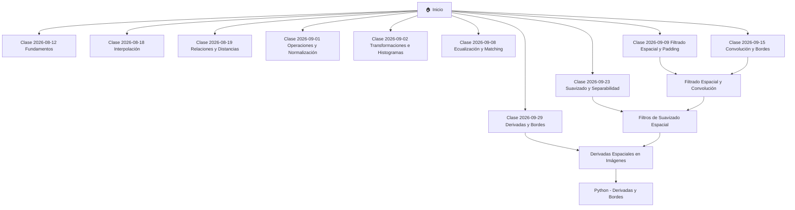

# 🎓 Visión Artificial

> [!info] Materia electiva
> Bóveda de apuntes de la electiva **Visión Artificial**.
> Organizada por **clases** (con fecha), **conceptos** (notas atómicas) y **código** (scripts explicados paso a paso), todo enlazado bidireccionalmente con wikilinks.

## 📅 Clases (por fecha)

> [!tip] Convención
> Cada clase se guarda en `Clases/` con el formato `YYYY-MM-DD - Título` para que se ordenen cronológicamente de forma automática.

- [[2026-08-12 - Fundamentos de Imágenes]] — fundamentos, niveles de gris, resolución y Python (Colab)
- [[2026-08-18 - Interpolación y Redimensionamiento]] — escalado $3\times$, interpolación (Nearest, Linear, Cubic, Exact) y Zoom en OpenCV
- [[2026-08-19 - Relaciones entre Píxeles y Métricas de Distancia]] — vecindades ($N_4, N_D, N_8$), $m$-adyacencia, caminos y distancias ($D_e, D_4, D_8$)
- [[2026-09-01 - Operaciones Aritméticas y Lógicas entre Imágenes]] — suma/promedio, resta, multiplicación, división, desbordamiento, saturación y normalización
- [[2026-09-02 - Transformaciones de Intensidad y Procesamiento de Histogramas]] — negativo, logarítmica, corrección gamma, estiramiento y ecualización de histogramas
- [[2026-09-08 - Ecualización y Especificación de Histogramas]] — imágenes de bajo contraste, ecualización global y especificación (*Histogram Matching*) con imágenes de referencia
- [[2026-09-09 - Filtrado Espacial, Convolución y Manejo de Bordes]] — máscaras/kernels, ventana deslizante, convolución vs correlación y los 4 métodos de padding
- [[2026-09-15 - Implementación de Convolución y Modos de Borde]] — verificación de kernels simétricos vs asimétricos, slicing `[::-1, ::-1]` y comparativa de padding
- [[2026-09-23 - Filtros de Suavizado y Separabilidad de Kernels]] — filtro de caja, filtro gaussiano, filtro de la mediana y optimización por separabilidad de $\mathcal{O}(K^2)$ a $\mathcal{O}(2K)$
- [[2026-09-29 - Derivadas Espaciales y Detección de Bordes]] — primera derivada ($d[i] = p[i+1] - p[i]$), segunda derivada ($f''$), matriz de la verdad, escalón vs rampa y Laplaciano

## 🧠 Conceptos

- [[Reducción de Niveles de Gris]] — cuantización de 256 a 8 niveles
- [[Tamaño de una Imagen Digital]] — $b = N \times M \times k$ y $k = \log_2(L)$
- [[Resolución de Imagen]] — muestreo (espacial) vs cuantización (intensidad)
- [[Interpolación]] — vecino más cercano, bilineal, bicúbica y variantes exactas
- [[Vecindad y Adyacencia de Píxeles]] — $N_4, N_D, N_8$, conjunto $V$, 4/8-adyacencia y $m$-adyacencia
- [[Métricas de Distancia en Imágenes]] — formulación y cálculo de $D_e, D_4, D_8$
- [[Operaciones Aritméticas entre Imágenes]] — suma, resta, multiplicación, división y aplicaciones
- [[Desbordamiento y Normalización de Imágenes]] — overflow modular, saturación y reescalado Min-Max
- [[Operaciones Lógicas y Álgebra Booleana en Imágenes]] — operadores binarios AND, OR, NOT, XOR y enmascaramiento
- [[Transformaciones de Intensidad Espacial]] — transformaciones puntuales $s = T(r)$, negativo, logarítmica, gamma y por tramos
- [[Histogramas y Ecualización de Imagen]] — funciones de distribución, análisis de contraste, CDF, ecualización y matching
- [[Filtrado Espacial y Convolución]] — máscaras impares, punto ancla, convolución 2D vs correlación cruzada y rotación de 180°
- [[Manejo de Bordes y Padding en Imágenes]] — frontera del kernel: recorte, zero-padding, replicación y reflexión
- [[Filtros de Suavizado Espacial]] — filtro de caja, filtro gaussiano, separabilidad $\mathcal{O}(K^2) \to \mathcal{O}(2K)$ y filtro de la mediana para ruido sal y pimienta
- [[Derivadas Espaciales en Imágenes]] — diferencias finitas, vector gradiente (Sobel), operador Laplaciano, rampas vs escalones y LoG

## 💻 Código

- [[Reducción de Niveles de Gris - Python]] — cuantización a 64, 20, 8 y 2 niveles con NumPy y Pillow
- [[Interpolación y Redimensionamiento - Python]] — redimensionamiento con `cv2.resize`, métodos clásicos y variantes `_EXACT` con inspección por zoom
- [[Métricas de Distancia y Conectividad - Python]] — funciones de cálculo de $D_e, D_4, D_8$ y mapas de isolíneas
- [[Operaciones Aritméticas y Normalización - Python]] — operaciones punto a punto, overflow, saturación y mezcla ponderada en OpenCV/scikit-image
- [[Transformaciones de Intensidad y Histogramas - Python]] — transformaciones de intensidad, corrección gamma y ecualización de histograma
- [[Ecualización y Especificación de Histogramas - Python]] — ecualización de imágenes de bajo contraste y emparejamiento de histogramas con `skimage.exposure`
- [[Filtrado Espacial y Modos de Padding - Python]] — modos de padding con `cv2.copyMakeBorder`, convolución vs correlación en SciPy y `cv2.filter2D`
- [[Filtros de Suavizado y Separabilidad - Python]] — comparación de Box vs Gaussian vs Median Blur y benchmark de separabilidad con `cv2.sepFilter2D`
- [[Derivadas y Bordes - Python]] — cálculo de Sobel $G_x, G_y$, Laplaciano, diferencias numéricas 1D y Laplaciano del Gaussiano (LoG)

## 🗺️ Estructura de la bóveda


```mermaid
graph TD
    Inicio[🏠 Inicio] --> C1[Clase 2026-08-12 Fundamentos]
    Inicio --> C2[Clase 2026-08-18 Interpolación]
    Inicio --> C3[Clase 2026-08-19 Relaciones y Distancias]
    Inicio --> C4[Clase 2026-09-01 Operaciones y Normalización]
    Inicio --> C5[Clase 2026-09-02 Transformaciones e Histogramas]
    Inicio --> C6[Clase 2026-09-08 Ecualización y Matching]
    Inicio --> C7[Clase 2026-09-09 Filtrado Espacial y Padding]
    Inicio --> C8[Clase 2026-09-15 Convolución y Bordes]
    Inicio --> C9[Clase 2026-09-23 Suavizado y Separabilidad]
    Inicio --> C10[Clase 2026-09-29 Derivadas y Bordes]
    
    C7 --> N12[Filtrado Espacial y Convolución]
    C8 --> N12
    C9 --> N14[Filtros de Suavizado Espacial]
    C10 --> N15[Derivadas Espaciales en Imágenes]
    
    N12 --> N14
    N14 --> N15
    N15 --> P9[Python - Derivadas y Bordes]
```

## 🛠️ Plantillas

- [[Plantilla de Clase]] — apuntes por sesión (con fecha)
- [[Plantilla de Concepto]] — notas atómicas por tema
- [[Plantilla de Código]] — scripts explicados

## 📌 ¿Cómo uso esta bóveda?

1. **Nueva clase** → usa [[Plantilla de Clase]] y nombra la nota `YYYY-MM-DD - Tema`.
2. **Concepto nuevo** → nota atómica en `Conceptos/` con la [[Plantilla de Concepto]].
3. **Código nuevo** → nota en `Código/` con la [[Plantilla de Código]].
4. Enlaza todo con `[[wikilinks]]`: clase ↔ concepto ↔ código.

## 📊 Vista dinámica (plugin Dataview)

> [!note] Opcional
> Si tienes instalado el plugin comunitario **Dataview**, estas tablas listan automáticamente tus clases y scripts:

```dataview
TABLE fecha, semana
FROM "Clases"
SORT fecha DESC
```

```dataview
TABLE fecha, clase as "Clase asociada"
FROM "Código"
SORT fecha DESC
```

## 🏷️ Etiquetas principales

- `#visión-artificial` · `#clase` · `#python` · `#opencv` · `#interpolación` · `#vecindad` · `#adyacencia` · `#distancias` · `#operaciones-aritméticas` · `#normalización` · `#transformaciones-espaciales` · `#histogramas` · `#ecualización` · `#filtrado-espacial` · `#convolución` · `#padding` · `#suavizado` · `#filtro-gaussiano` · `#filtro-mediana` · `#derivadas-espaciales` · `#detección-de-bordes` · `#gradiente` · `#laplaciano`
